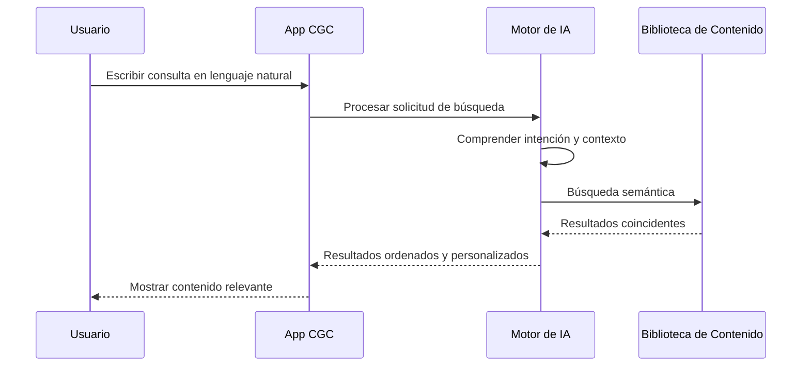

# Funciones con Inteligencia Artificial

La plataforma de CGC utiliza inteligencia artificial para ayudarte a descubrir contenido, encontrar respuestas y recibir recomendaciones personalizadas. Estas funciones están diseñadas para mejorar tu experiencia y facilitar la interacción con la biblioteca de sermones, música y más de la iglesia.

*Diagrama: Flujo de búsqueda con IA*

## Búsqueda de Sermones con IA

Encontrar el sermón indicado nunca ha sido tan fácil. Nuestra búsqueda con IA va más allá de la simple coincidencia de palabras clave para entender lo que estás buscando.

### Cómo funciona

- **Búsqueda en lenguaje natural** — En lugar de buscar títulos exactos, puedes describir lo que buscas en tus propias palabras. Por ejemplo, busca "sermones sobre vencer el miedo" o "mensajes sobre la fe en tiempos difíciles."
- **Comprensión contextual** — La IA entiende el significado detrás de tus palabras, no solo las palabras en sí. Puede encontrar sermones relevantes incluso si tus términos exactos de búsqueda no aparecen en el título o la descripción.
- **Reconocimiento de temas** — El motor de búsqueda reconoce temas bíblicos, referencias de las Escrituras y temas comunes, para que puedas buscar por tema y obtener resultados precisos.

### Consejos para mejores resultados de búsqueda

- Sé descriptivo — "Cómo fortalecer tu vida de oración" dará mejores resultados que solo "oración"
- Incluye contexto — Mencionar un tema, escritura o temática ayuda a la IA a encontrar el contenido más relevante
- Prueba diferentes frases — Si tu primera búsqueda no devuelve lo esperado, intenta reformular tu consulta

---

## Asistente de Chat con IA

El Asistente de Chat con IA es una herramienta conversacional integrada en la aplicación de CGC que puede ayudarte a encontrar contenido, responder preguntas y guiarte a través de la plataforma.

### Qué puede hacer el asistente de IA

- **Responder preguntas sobre contenido** — Pregunta cosas como "¿Qué sermones hay disponibles sobre el Libro de Apocalipsis?" o "Muéstrame sermones recientes de este mes."
- **Ayudarte a navegar** — Si no estás seguro de dónde encontrar algo, pregúntale al asistente. Por ejemplo, "¿Cómo descargo un sermón?" o "¿Dónde puedo actualizar mi método de pago?"
- **Proporcionar contexto bíblico** — Pregunta sobre un pasaje de las Escrituras y el asistente puede ayudarte a encontrar sermones y contenido relacionado en la biblioteca.
- **Resumir contenido** — Obtén un breve resumen de lo que cubre un sermón antes de escucharlo.

### Cómo usar el asistente de IA

1. Abre la aplicación de CGC
2. Toca el ícono de **chat** (generalmente se encuentra en la navegación inferior o como un botón flotante)
3. Escribe tu pregunta o solicitud en lenguaje natural
4. El asistente responderá con información útil, enlaces y sugerencias

::: tip
El asistente de IA está diseñado para ayudarte a encontrar y disfrutar contenido en la plataforma de CGC. Para problemas de cuenta o facturación, comunícate con **support@christgospel.org** para recibir ayuda personalizada.
:::

---

## Recomendaciones Inteligentes

La plataforma de CGC aprende de tus hábitos de escucha para sugerirte contenido que podrías disfrutar.

### Cómo funcionan las recomendaciones

- **Basadas en tu historial** — Cuanto más escuches, mejores serán las recomendaciones. La plataforma registra qué predicadores, temas y series disfrutas y sugiere contenido similar.
- **Basadas en contenido popular** — Los sermones y canciones populares en la comunidad pueden aparecer como recomendaciones, especialmente para usuarios nuevos.
- **Selecciones semanales** — Cada semana, la plataforma destaca sermones y música recomendados basados en tendencias y tus intereses personales.
- **Contenido relacionado** — Cuando estás escuchando o viendo un sermón, verás sugerencias de "Sermones Relacionados" o "También Te Podría Gustar" cerca.

### Dónde encontrar recomendaciones

- **Pantalla de inicio** — Las recomendaciones personalizadas aparecen en la pantalla de inicio de la aplicación
- **Después de la reproducción** — Cuando un sermón o canción termina, verás sugerencias de qué escuchar a continuación
- **Sección Explorar** — Navega por recomendaciones curadas organizadas por tema, predicador o temática

---

## Cómo la IA Mejora Tu Experiencia

Todas las funciones de IA en la plataforma de CGC están diseñadas con un solo objetivo: ayudarte a conectar con el contenido que más te importa. Aquí tienes un resumen de cómo la IA mejora la plataforma:

| Función | Qué hace por ti |
|---|---|
| **Búsqueda con IA** | Encuentra sermones usando lenguaje natural, para que no necesites saber títulos o palabras clave exactas |
| **Asistente de Chat con IA** | Responde tus preguntas y te ayuda a navegar la plataforma de manera conversacional |
| **Recomendaciones Inteligentes** | Sugiere sermones, música y contenido adaptado a tus intereses e historial de escucha |
| **Contenido Relacionado** | Te muestra sermones y contenido multimedia similar para que puedas seguir explorando temas que te interesan |

### Privacidad e IA

Tu privacidad es importante para nosotros. Así es como manejamos tus datos con respecto a las funciones de IA:

- Los datos de recomendaciones se usan únicamente para mejorar tu experiencia personal en la plataforma de CGC
- Tu historial de escucha se mantiene privado y no se comparte con otros usuarios
- Puedes borrar tu historial de escucha en cualquier momento en **Configuración > Privacidad**
- Las funciones de IA se pueden usar sin suscripción, aunque parte del contenido que recomiendan puede requerir acceso premium

---

## ¿Preguntas Sobre las Funciones de IA?

Si tienes preguntas sobre cómo funcionan las funciones de IA o deseas compartir comentarios, contáctanos en **support@christgospel.org**. Siempre estamos buscando formas de mejorar la experiencia.
