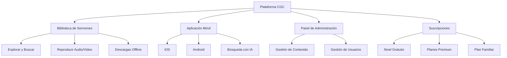

# Funciones

Un resumen de todo lo disponible en la plataforma digital de CGC.

*Diagrama: Resumen de funciones de la plataforma CGC*

## Biblioteca de Sermones

Navega y reproduce sermones de nuestro catálogo de predicadores. Filtra por tema, fecha o predicador. Descarga para escuchar sin conexión.

## Aplicación Móvil

- Multiplataforma (iOS y Android)
- Soporte de contenido offline
- Notificaciones push para nuevo contenido
- Interfaz bilingüe (Inglés/Español)

## Panel de Administración

Para administradores de la iglesia:
- Gestión de sermones (subir, programar, categorizar)
- Gestión de usuarios y asignación de roles
- Supervisión de suscripciones y pagos
- Gestión de biblioteca multimedia
- Configuraciones de seguridad y controles de acceso

## Suscripciones

- Múltiples niveles de planes
- Pago seguro a través de Stripe
- Opciones de plan familiar
- Gestión y cancelación sencillas
