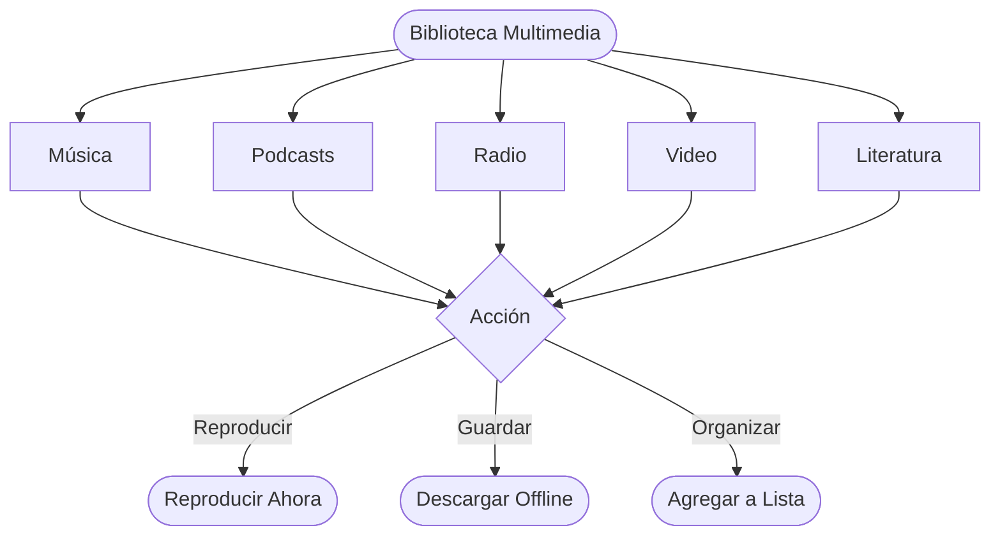

# Biblioteca Multimedia

La plataforma de CGC ofrece una rica biblioteca multimedia que va más allá de los sermones. Desde música y podcasts hasta libros y listas de reproducción curadas, hay una gran variedad de contenido para explorar y disfrutar.

*Diagrama: Flujo de navegación multimedia*

## Música

La biblioteca de música de CGC presenta una colección en crecimiento de canciones, álbumes y artistas de la comunidad de Christ Gospel Church.

### Explorar música

- **Canciones** — Navega por canciones individuales o usa la barra de búsqueda para encontrar una pista específica
- **Álbumes** — Ve álbumes completos con listas de canciones y arte de portada
- **Artistas** — Explora todas las canciones y álbumes de un artista específico
- **Géneros** — Filtra música por género para encontrar el estilo que disfrutas

### Escuchar música

1. Navega a la sección de **Música** en la aplicación
2. Explora o busca una canción, álbum o artista
3. Toca una canción para comenzar a reproducirla
4. Usa los controles del reproductor para pausar, saltar, ajustar el volumen o avanzar en la pista
5. La música se reproduce en segundo plano para que puedas seguir usando la aplicación o bloquear tu pantalla

### Agregar música a listas de reproducción

1. Mientras ves una canción, toca el **menú de tres puntos** (o mantén presionada la canción)
2. Selecciona **Agregar a Lista de Reproducción**
3. Elige una lista existente o crea una nueva
4. La canción se agregará a tu lista de reproducción

---

## Podcasts y Radio

Mantente conectado con el contenido de la iglesia a través de podcasts y programación estilo radio.

### Podcasts

- Explora las series de podcasts disponibles en la sección de **Podcasts**
- Cada serie contiene múltiples episodios organizados cronológicamente
- Toca un episodio para reproducirlo, o descárgalo para escuchar sin conexión (se requiere suscripción)
- Se agregan nuevos episodios regularmente — activa las notificaciones push para recibir alertas cuando haya nuevo contenido disponible

### Radio

- La función de radio proporciona transmisión continua de contenido curado
- Sintoniza para disfrutar una mezcla de sermones, música y programación hablada
- No necesitas elegir qué escuchar — solo presiona reproducir y disfruta

---

## Contenido en Video

La plataforma de CGC incluye sermones en video y otro contenido de video que puedes reproducir directamente en la aplicación o el navegador.

### Ver videos

1. Navega por el área de contenido de **video** o busca el ícono de video en los sermones que tienen video disponible
2. Toca para comenzar la reproducción
3. Los videos se reproducen en el reproductor integrado con controles estándar (reproducir, pausar, avanzar, pantalla completa, volumen)
4. Gira tu dispositivo a modo horizontal para una experiencia de pantalla completa en el móvil

### Calidad de video

- Los videos se transmiten en calidad adaptativa por defecto, ajustándose a la velocidad de tu internet
- Para la mejor experiencia, usa una conexión Wi-Fi fuerte
- Si experimentas interrupciones, intenta reducir la calidad de transmisión en **Configuración > Reproducción**

### Descargar videos

- Con una suscripción activa, puedes descargar sermones en video para verlos sin conexión
- Las descargas de video son más grandes que las de audio (consulta la [Guía de Descargas y Offline](/es/help/offline-downloads) para estimaciones de tamaño)
- Considera descargar por Wi-Fi para evitar usar datos móviles

---

## Listas de Reproducción

Las listas de reproducción te permiten organizar tus sermones, canciones y otro contenido favorito en colecciones personalizadas.

### Listas de reproducción personales

Puedes crear tantas listas de reproducción personales como desees:

1. Ve a la sección de **Listas de Reproducción** o toca el menú de tres puntos en cualquier contenido
2. Selecciona **Agregar a Lista de Reproducción**
3. Elige **Crear Nueva Lista** y ponle un nombre, o agrégalo a una lista existente
4. Tus listas de reproducción se guardan en tu cuenta y están disponibles en todos tus dispositivos

### Gestionar tus listas de reproducción

- **Reordenar elementos** — Abre una lista y arrastra los elementos para reorganizar el orden
- **Eliminar elementos** — Desliza a la izquierda sobre un elemento (iOS) o mantén presionado y selecciona Eliminar (Android)
- **Renombrar una lista** — Toca el título de la lista o el ícono de edición para cambiar el nombre
- **Eliminar una lista** — Abre la lista, toca el menú de tres puntos y selecciona **Eliminar Lista de Reproducción**

### Listas de reproducción destacadas

El equipo de CGC cura listas de reproducción destacadas que aparecen en la pantalla de inicio y en la sección de Listas de Reproducción. Son colecciones seleccionadas a mano organizadas por temas, eventos o series de sermones. Las listas destacadas se actualizan regularmente.

### Compartir listas de reproducción

- Puedes compartir una lista de reproducción con otros tocando el botón **Compartir** en la lista
- Se generará un enlace compartible que el destinatario puede abrir en la aplicación
- Las listas compartidas son de solo lectura para el destinatario — pueden escuchar pero no editar tu lista

---

## Literatura y Libros

La plataforma de CGC incluye una biblioteca de libros y contenido escrito para lectura y estudio.

### Explorar literatura

- Ve a la sección de **Literatura** o **Libros** en la aplicación
- Navega por título, autor o categoría
- Usa la barra de búsqueda para encontrar libros específicos

### Lectura

1. Toca un libro para abrirlo
2. El lector integrado te permite leer directamente en la aplicación
3. Usa los controles para ajustar el tamaño del texto, navegar entre capítulos y marcar páginas
4. Tu progreso de lectura se guarda automáticamente y se sincroniza entre dispositivos

### Descargar libros

- Con una suscripción activa, puedes descargar libros para leer sin conexión
- Los libros descargados están disponibles en la sección de **Descargas** junto con tu otro contenido offline

---

## Disponibilidad de Contenido

La biblioteca multimedia de CGC se actualiza regularmente con nuevo contenido. Aquí tienes una referencia rápida de lo que está disponible:

| Tipo de Contenido | Transmisión | Descarga (Offline) | Se Requiere Suscripción para Descargar |
|---|---|---|---|
| Sermones (audio) | Sí | Sí | Sí |
| Sermones (video) | Sí | Sí | Sí |
| Música (canciones) | Sí | Sí | Sí |
| Podcasts | Sí | Sí | Sí |
| Radio | Sí | No | No |
| Contenido en video | Sí | Sí | Sí |
| Literatura / Libros | Sí | Sí | Sí |

::: info
La transmisión está disponible para todos los usuarios. Descargar contenido para acceso offline requiere una suscripción activa.
:::

---

## Consejos para Aprovechar al Máximo la Biblioteca Multimedia

- **Usa listas de reproducción** para organizar contenido para diferentes ocasiones — devocionales matutinos, escucha durante el trayecto, tiempo de estudio
- **Activa las notificaciones push** para saber cuándo se agrega nuevo contenido
- **Descarga por Wi-Fi** para ahorrar datos móviles y obtener descargas más rápidas
- **Explora las listas destacadas** para colecciones curadas que podrías no descubrir por tu cuenta
- **Prueba la búsqueda con IA** para encontrar contenido describiendo lo que buscas con tus propias palabras (ver [Funciones con IA](/es/features/ai-features))

---

## ¿Preguntas?

Si tienes sugerencias de contenido que te gustaría ver en la biblioteca multimedia, o si tienes problemas para acceder a algún contenido, contáctanos en **support@christgospel.org**.
