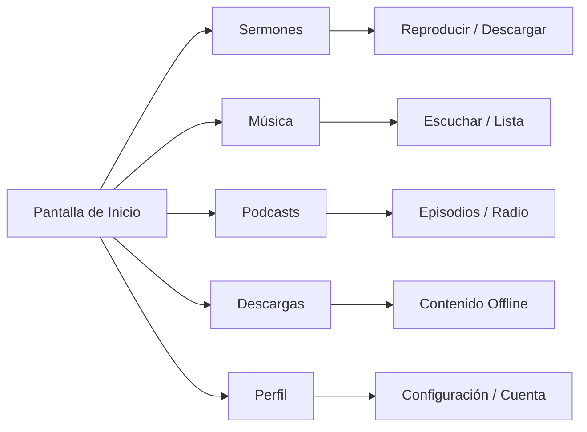

# Aplicación Móvil

La aplicación móvil de CGC lleva la iglesia a tu bolsillo. Reproduce sermones, escucha música, lee libros y mantente conectado con tu congregación — todo desde tu teléfono o tableta.

## Descargar la Aplicación

- **iOS (iPhone / iPad)**: Descárgala desde la [App Store](https://apps.apple.com)
- **Android**: Descárgala desde [Google Play](https://play.google.com)

La aplicación es gratuita. Una suscripción desbloquea funciones premium como descargas offline y acceso completo a la biblioteca multimedia.

## Requisitos del Dispositivo

- **iOS**: Versión 15.0 o posterior (iPhone, iPad, iPod touch)
- **Android**: Versión 10.0 (API 29) o posterior
- Se requiere conexión a internet para la transmisión (el modo offline está disponible para contenido descargado)

---

## Resumen de Funciones

*Diagrama: Mapa de funciones de la aplicación*

Esto es todo lo que ofrece la aplicación móvil de CGC:

| Función | Descripción |
|---|---|
| Biblioteca de sermones | Navega, busca, reproduce y descarga sermones |
| Biblioteca de música | Escucha canciones, álbumes y artistas |
| Podcasts y radio | Reproduce episodios de podcasts y radio en vivo |
| Literatura | Lee libros y contenido escrito |
| Listas de reproducción | Crea y gestiona listas de reproducción personales |
| Descargas offline | Descarga contenido para escuchar sin internet |
| Búsqueda con IA | Encuentra contenido usando lenguaje natural |
| Asistente de chat con IA | Obtén ayuda y descubre contenido a través de conversación |
| Notificaciones push | Mantente informado sobre nuevo contenido y anuncios |
| Interfaz bilingüe | Usa la aplicación en inglés o español |
| Personalización de temas | Elige entre más de 12 temas visuales |
| Inicio de sesión biométrico | Inicia sesión con Face ID, Touch ID o huella digital |
| Reproducción en segundo plano | Sigue escuchando mientras usas otras aplicaciones |
| Gestión de suscripción | Ve y gestiona tu plan directamente en la aplicación |

---

## Personalización de Temas

La aplicación de CGC ofrece una variedad de temas visuales para que puedas personalizar la apariencia.

### Temas disponibles

La aplicación incluye **más de 12 temas** para elegir, incluyendo:

- **Claro** — Limpio y brillante
- **Oscuro** — Fácil para la vista, ideal para uso nocturno
- **Predeterminado del Sistema** — Se ajusta automáticamente a la configuración de modo claro/oscuro de tu dispositivo
- Temas de colores adicionales con diferentes acentos y fondos

### Cómo cambiar tu tema

1. Abre la aplicación y ve a **Configuración**
2. Toca **Apariencia** o **Tema**
3. Navega por los temas disponibles — una vista previa muestra cómo se ve cada uno
4. Toca un tema para aplicarlo
5. El cambio surte efecto inmediatamente

---

## Modo Offline

Con una suscripción activa, puedes descargar contenido y acceder a él sin conexión a internet.

### Qué puedes hacer sin conexión

- Escuchar sermones descargados (audio y video)
- Escuchar música descargada
- Leer libros descargados
- Reproducir episodios de podcasts descargados
- Acceder a tus listas de reproducción (si el contenido dentro de ellas ha sido descargado)

### Qué requiere conexión a internet

- Transmitir cualquier contenido
- Buscar en la biblioteca
- Usar el asistente de chat con IA
- Gestionar tu suscripción o método de pago
- Recibir notificaciones push

### Cómo descargar contenido

1. Encuentra el contenido que quieres guardar
2. Toca el botón **Descargar** (ícono de flecha hacia abajo)
3. Espera a que se complete la descarga
4. Accede a él en cualquier momento en la sección de **Descargas**

Para instrucciones detalladas, estimaciones de almacenamiento y solución de problemas, consulta la [Guía de Descargas y Offline](/es/help/offline-downloads).

---

## Notificaciones Push

Mantente al día con las notificaciones push de CGC.

### De qué serás notificado

- Nuevos sermones agregados a la biblioteca
- Nuevos lanzamientos de música
- Contenido destacado semanal
- Anuncios especiales de tu iglesia
- Recordatorios de suscripción (renovación, vencimiento)

### Cómo configurar las notificaciones

**Activar notificaciones:**
1. Cuando instalas la aplicación por primera vez, se te pedirá permitir notificaciones — toca **Permitir**
2. Si previamente denegaste el permiso de notificaciones, puedes habilitarlo en la configuración de tu dispositivo:
   - **iOS**: Ve a Configuración > Notificaciones > CGC > activa **Permitir Notificaciones**
   - **Android**: Ve a Configuración > Aplicaciones > CGC > Notificaciones > activa las notificaciones

**Personalizar notificaciones:**
1. Abre la aplicación de CGC y ve a **Configuración > Notificaciones**
2. Elige qué tipos de notificaciones deseas recibir:
   - Alertas de nuevo contenido
   - Recomendaciones semanales
   - Anuncios
   - Recordatorios de suscripción y facturación
3. Activa o desactiva cada categoría según lo desees

::: tip
Si no estás recibiendo notificaciones, verifica que No Molestar no esté activo en tu dispositivo y que la aplicación tenga la actualización en segundo plano habilitada. Consulta [Solución de Problemas](/es/help/troubleshooting) para más ayuda.
:::

---

## Inicio de Sesión Biométrico

Para un acceso rápido y seguro, puedes iniciar sesión usando la autenticación biométrica de tu dispositivo.

### Métodos compatibles

- **Face ID** (iPhone X y posteriores)
- **Touch ID** (iPhones y iPads con botón de inicio)
- **Huella digital** (dispositivos Android con sensor de huella)

### Cómo configurar el inicio de sesión biométrico

1. Inicia sesión en la aplicación con tu correo electrónico y contraseña
2. Ve a **Configuración > Seguridad**
3. Activa **Inicio de Sesión Biométrico** (o Face ID / Huella Digital, dependiendo de tu dispositivo)
4. Es posible que se te pida confirmar con tu biométrico para habilitarlo
5. La próxima vez que abras la aplicación, podrás iniciar sesión con un escaneo rápido en lugar de escribir tu contraseña

::: info
El inicio de sesión biométrico es una función de conveniencia opcional. Siempre puedes iniciar sesión con tu correo electrónico y contraseña.
:::

---

## Cambio de Idioma

La aplicación de CGC soporta **inglés** y **español**. Puedes cambiar entre idiomas en cualquier momento.

### Cómo cambiar el idioma

1. Abre la aplicación y ve a **Configuración**
2. Toca **Idioma**
3. Selecciona **Inglés** o **Español**
4. La aplicación se actualizará inmediatamente al idioma seleccionado

Todos los menús, botones, etiquetas y mensajes del sistema se mostrarán en el idioma elegido. La disponibilidad de contenido (sermones, música, etc.) no se ve afectada por la configuración del idioma.

---

## Reproducción de Audio en Segundo Plano

La aplicación de CGC soporta audio en segundo plano para que puedas seguir escuchando mientras haces otras cosas.

### Cómo funciona

- Comienza a reproducir un sermón, canción o episodio de podcast
- Cambia a otra aplicación, ve a la pantalla de inicio o bloquea tu dispositivo
- El audio continuará reproduciéndose en segundo plano
- Controla la reproducción desde la **pantalla de bloqueo** o la **barra de notificaciones** de tu dispositivo (pausar, reproducir, saltar)
- En iOS, también puedes controlar la reproducción desde el **Centro de Control**

### Si el audio en segundo plano se detiene

- Asegúrate de que la **Actualización en Segundo Plano** esté habilitada para la aplicación de CGC en la configuración de tu dispositivo
- **Android**: Verifica que la optimización de batería no esté configurada para restringir la aplicación. Ve a Configuración > Aplicaciones > CGC > Batería y selecciona **Sin restricciones**
- **iOS**: Ve a Configuración > General > Actualización en Segundo Plano y asegúrate de que CGC esté activado
- Consulta [Solución de Problemas](/es/help/troubleshooting) para más soluciones

---

## Gestión de Descargas

Gestiona tu contenido descargado para mantener tu dispositivo organizado y liberar almacenamiento cuando sea necesario.

### Ver tus descargas

1. Ve a la sección de **Descargas** desde el menú principal o la navegación inferior
2. Ve todo tu contenido descargado listado con tamaños de archivo y fechas
3. Toca cualquier elemento para reproducirlo

### Uso de almacenamiento

- Ve el almacenamiento total usado por la aplicación de CGC en **Configuración > Almacenamiento**
- Ve un desglose del almacenamiento por tipo de contenido (audio, video, libros)

### Liberar espacio

- Elimina descargas individuales deslizando a la izquierda (iOS) o manteniendo presionado (Android) y seleccionando **Eliminar**
- Borra todas las descargas a la vez en **Configuración > Almacenamiento > Borrar Todas las Descargas**
- Considera descargar versiones solo de audio en lugar de video para ahorrar espacio

### Configuración de calidad de descarga

- Ajusta la calidad de descarga de audio en **Configuración > Descargas > Calidad de Audio** (Estándar o Alta)
- Ajusta la calidad de descarga de video en **Configuración > Descargas > Calidad de Video** (SD o HD)
- Configuraciones de menor calidad usan menos almacenamiento pero pueden tener menor fidelidad de audio o video

---

## Funciones Adicionales

### Perfil y configuración de cuenta

- Actualiza tu nombre, correo electrónico y foto de perfil en **Configuración > Perfil**
- Cambia tu contraseña en **Configuración > Cuenta > Cambiar Contraseña**
- Ve el estado de tu suscripción y gestiona la facturación en **Configuración > Suscripción**

### Controles de reproducción

- **Control de velocidad** — Ajusta la velocidad de reproducción (0.5x, 0.75x, 1x, 1.25x, 1.5x, 2x) para sermones y podcasts
- **Temporizador de sueño** — Establece un temporizador para detener automáticamente la reproducción después de una duración determinada (15, 30, 45 o 60 minutos)
- **Avance** — Arrastra la barra de progreso para saltar a cualquier punto del contenido

### Accesibilidad

- La aplicación soporta las funciones de accesibilidad integradas de tu dispositivo, incluyendo VoiceOver (iOS) y TalkBack (Android)
- Los tamaños de texto ajustables siguen la configuración de tamaño de fuente del sistema de tu dispositivo

---

## ¿Preguntas?

Para ayuda con la aplicación móvil, consulta nuestra guía de [Solución de Problemas](/es/help/troubleshooting) o las [Preguntas Frecuentes](/es/help/faq). También puedes contactarnos en **support@christgospel.org**.
