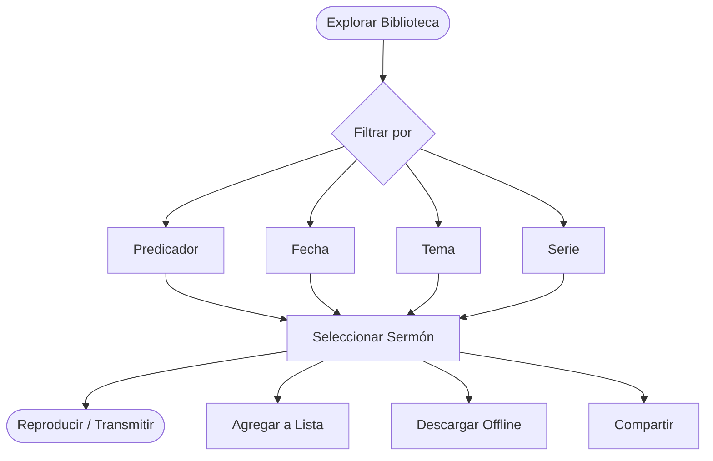

# Sermones

La biblioteca de sermones es el corazón de la plataforma de CGC. Con miles de sermones disponibles, puedes navegar, reproducir, descargar y organizar mensajes de predicadores de toda la comunidad de Christ Gospel Church.

*Diagrama: Recorrido de descubrimiento de sermones*

## Explorar Sermones

Hay varias formas de encontrar sermones en la biblioteca:

### Por predicador

- Ve a la sección de **Sermones** y selecciona **Predicadores**
- Navega por la lista de predicadores, cada uno con foto y nombre
- Toca un predicador para ver todos sus sermones disponibles
- Los sermones se listan con los más recientes primero por defecto

### Por tema

- Selecciona **Temas** o **Categorías** para filtrar sermones por temática
- Los temas incluyen áreas como fe, oración, adoración, familia, salvación y muchos más
- Toca un tema para ver todos los sermones etiquetados con esa temática

### Por fecha

- Navega por los sermones cronológicamente usando el filtro de **Fecha**
- Ve sermones de un mes, año o rango de fechas específico
- Útil para encontrar sermones de un servicio o evento en particular

### Por serie de sermones

- Muchos sermones son parte de una **serie** de varias partes
- Navega por las series disponibles para seguir la enseñanza de un predicador sobre un tema de principio a fin
- Las series se muestran con el número de partes y el nombre del predicador

### Usando la búsqueda

- Toca el ícono de **Búsqueda** y escribe una palabra clave, título, referencia bíblica o frase
- El motor de búsqueda usa [búsqueda con IA](/es/features/ai-features) para entender lo que estás buscando, incluso si no usas el título exacto
- Los resultados se clasifican por relevancia e incluyen sermones, series y contenido relacionado
- Puedes filtrar los resultados por predicador, tema, fecha y tipo de contenido (audio o video)

### Metadatos disponibles

Cada sermón incluye detalles útiles:

- **Título** — El nombre del sermón
- **Predicador** — Quién entregó el mensaje
- **Fecha** — Cuándo se predicó el sermón
- **Tema / Categoría** — Los temas tratados
- **Referencia Bíblica** — Pasajes clave de la Biblia referenciados en el sermón
- **Duración** — La duración del sermón
- **Descripción** — Un breve resumen del contenido del sermón
- **Serie** — Si el sermón es parte de una serie, el nombre de la serie y número de parte

---

## Reproducir Sermones

Puedes reproducir cualquier sermón directamente en la aplicación o navegador web sin descargarlo primero.

### Cómo reproducir

1. Encuentra el sermón que quieres escuchar o ver
2. Toca el sermón para abrirlo
3. Toca el botón **Reproducir** para comenzar la transmisión
4. Usa los controles del reproductor para pausar, retroceder, adelantar o ajustar el volumen

### Opciones de calidad de transmisión

- **Audio**: Disponible en calidad Estándar y Alta. La calidad Alta proporciona audio más claro pero usa más datos.
- **Video**: Los videos se transmiten en calidad adaptativa por defecto, ajustándose automáticamente a la velocidad de tu internet para una reproducción fluida.
- Puedes establecer tu calidad de transmisión preferida en **Configuración > Reproducción > Calidad de Transmisión**.

### Reproducción en segundo plano

- Cuando comienzas a reproducir un sermón, el audio continúa reproduciéndose incluso si:
  - Cambias a otra aplicación
  - Bloqueas la pantalla de tu teléfono
  - Navegas a una sección diferente de la aplicación de CGC
- Controla la reproducción desde la pantalla de bloqueo o la barra de notificaciones de tu dispositivo
- Asegúrate de que el **audio en segundo plano** esté habilitado en la configuración de tu dispositivo para una escucha ininterrumpida

::: tip
Para la mejor experiencia de transmisión, usa una conexión Wi-Fi. La transmisión de audio usa aproximadamente 1 MB por minuto, y el video usa aproximadamente 5-10 MB por minuto.
:::

---

## Descargar Sermones para Escuchar Sin Conexión

Con una suscripción activa, puedes descargar sermones a tu dispositivo para acceso offline. Esto es perfecto para cuando no tienes conexión a internet, como al viajar o ir al trabajo.

### Cómo descargar

1. Encuentra el sermón que quieres descargar
2. Toca el botón **Descargar** (ícono de flecha hacia abajo)
3. Elige si descargar **solo audio** o **video** (si está disponible)
4. La descarga comenzará — un indicador de progreso mostrará el estado
5. Una vez completada, el sermón aparecerá en tu sección de **Descargas**

### Configuración de descargas

Personaliza tus preferencias de descarga en **Configuración > Descargas**:

- **Solo Wi-Fi** — Cuando está habilitado, las descargas solo comenzarán cuando estés conectado a Wi-Fi (recomendado para ahorrar datos móviles). Está activado por defecto.
- **Calidad de audio** — Elige entre calidad Estándar y Alta
- **Calidad de video** — Elige entre Estándar (SD) y Alta (HD). Mayor calidad significa archivos más grandes.

### Gestionar descargas

- Ve todas tus descargas en la sección de **Descargas**
- Ve el tamaño del archivo y la fecha de cada descarga
- Elimina descargas individuales deslizando a la izquierda (iOS) o manteniendo presionado (Android)
- Borra todas las descargas a la vez en **Configuración > Almacenamiento > Borrar Todas las Descargas**

Para más detalles, consulta la [Guía de Descargas y Offline](/es/help/offline-downloads).

---

## Crear Listas de Reproducción

Organiza tus sermones favoritos en listas de reproducción personalizadas para fácil acceso.

### Cómo crear una lista de reproducción

1. Mientras ves un sermón, toca el **menú de tres puntos** (o mantén presionado el sermón)
2. Selecciona **Agregar a Lista de Reproducción**
3. Toca **Crear Nueva Lista** y ponle un nombre
4. El sermón se agregará a tu nueva lista de reproducción

### Cómo agregar sermones a una lista existente

1. Toca el menú de tres puntos en cualquier sermón
2. Selecciona **Agregar a Lista de Reproducción**
3. Elige la lista de tu colección
4. El sermón se agrega al final de la lista

### Gestionar listas de reproducción

- **Reordenar**: Abre una lista y arrastra los elementos para cambiar el orden
- **Eliminar**: Desliza a la izquierda sobre un sermón (iOS) o mantén presionado y selecciona Eliminar (Android)
- **Renombrar**: Toca el nombre de la lista o el ícono de edición para renombrarla
- **Borrar**: Abre la lista, toca el menú de tres puntos y selecciona **Eliminar Lista de Reproducción**

Tus listas de reproducción se sincronizan en todos los dispositivos donde hayas iniciado sesión con la misma cuenta.

---

## Compartir Sermones

Comparte sermones con amigos, familia y tu comunidad.

### Cómo compartir

1. Abre el sermón que quieres compartir
2. Toca el botón **Compartir** (el ícono de compartir)
3. Elige cómo quieres compartir:
   - **Copiar enlace** — Copia un enlace compartible a tu portapapeles
   - **Compartir vía aplicación** — Abre la hoja de compartir de tu dispositivo para que puedas enviar el enlace a través de aplicaciones de mensajería, correo electrónico, redes sociales y más
4. El destinatario puede tocar el enlace para abrir el sermón en la aplicación de CGC (si está instalada) o en la web

::: info
Compartir envía un enlace al sermón. El destinatario puede necesitar una cuenta o suscripción para acceder a cierto contenido.
:::

---

## Series de Sermones

Muchos sermones están organizados en series de varias partes que exploran un tema o pasaje bíblico en profundidad.

### Cómo encontrar series

- Navega por la sección de **Series** para ver todas las series de sermones disponibles
- Cada serie muestra el título, predicador, número de partes y una descripción
- Toca una serie para ver todos los sermones incluidos en orden

### Seguir una serie

- Reproduce una serie desde el principio y cada sermón estará listado en orden
- La aplicación lleva un registro de tu progreso dentro de una serie
- Retoma donde lo dejaste en cualquier momento

---

## Para Administradores

Los administradores pueden gestionar sermones a través del Panel de Administración en [admin.christgospel.org](https://admin.christgospel.org). Las capacidades de administración incluyen:

- **Subir** archivos de audio y video
- **Establecer metadatos** — títulos, descripciones, predicadores, temas, referencias bíblicas y series
- **Programar** sermones para fechas de publicación futuras
- **Editar** sermones existentes en cualquier momento
- **Organizar** sermones en series y categorías
- **Gestionar archivos multimedia** — reemplazar o actualizar archivos de audio y video
- **Destacar sermones** — seleccionar el Sermón de la Semana para resaltar en la pantalla de inicio

Para una guía completa sobre la gestión de sermones como administrador, consulta la [Guía del Administrador de la Iglesia](/es/help/admin-guide).

---

## ¿Preguntas?

Si tienes problemas para encontrar o reproducir un sermón, consulta nuestra guía de [Solución de Problemas](/es/help/troubleshooting) o contáctanos en **support@christgospel.org**.
