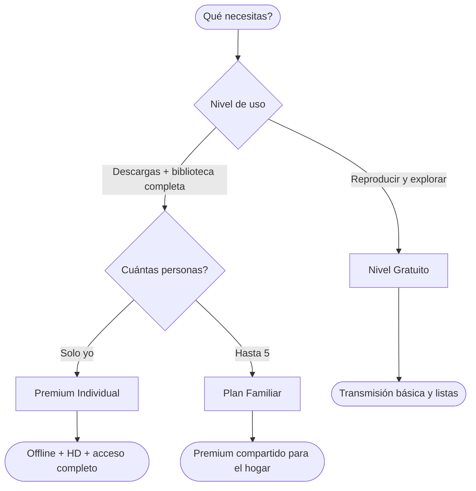

# Suscripciones

Accede a contenido premium y apoya a Christ Gospel Church a través de suscripciones. Ya seas un oyente individual o quieras compartir con tu familia, hay un plan para ti.

*Diagrama: Árbol de decisión de comparación de planes*

## Niveles de Plan

La plataforma de CGC ofrece múltiples niveles de suscripción para adaptarse a tus necesidades. Visita [subscriptions.christgospel.org](https://subscriptions.christgospel.org) para ver los planes y precios actuales.

### Nivel Gratuito

Todos con una cuenta de CGC tienen acceso al nivel gratuito, que incluye:

- Navegar y reproducir sermones (audio y video)
- Buscar en la biblioteca de sermones
- Crear listas de reproducción personales
- Acceso a la búsqueda con IA
- Usar la aplicación en inglés o español
- Recibir notificaciones push de nuevo contenido

### Plan Premium (Individual)

El plan Premium desbloquea la experiencia completa de CGC para un solo usuario:

- Todo lo del nivel Gratuito, más:
- **Descargas offline** — Descarga sermones, música, podcasts y libros para acceso sin conexión
- **Transmisión de alta calidad** — Accede a opciones de mayor calidad de audio y video
- **Acceso completo a la biblioteca multimedia** — Acceso ilimitado a música, podcasts, literatura y todo el contenido premium
- **Soporte prioritario** — Recibe respuestas más rápidas de nuestro equipo de soporte
- **Experiencia sin anuncios** — Disfruta del contenido sin interrupciones

### Plan Familiar

El plan Familiar da a tu hogar acceso a funciones premium a un mejor precio:

- Todo lo del plan Premium
- **Hasta 5 cuentas** — Un titular de cuenta principal más hasta 4 miembros de la familia
- **Perfiles individuales** — Cada miembro de la familia tiene su propia cuenta con listas de reproducción personales, preferencias e historial de descargas
- **Facturación compartida** — Una suscripción cubre a toda la familia con un solo pago

---

## Comparación Gratuito vs. Premium

| Función | Gratuito | Premium / Familiar |
|---|---|---|
| Reproducir sermones (audio y video) | Sí | Sí |
| Buscar y explorar biblioteca | Sí | Sí |
| Crear listas de reproducción | Sí | Sí |
| Búsqueda con IA | Sí | Sí |
| Soporte bilingüe (EN/ES) | Sí | Sí |
| Notificaciones push | Sí | Sí |
| Descargas offline | No | Sí |
| Transmisión de alta calidad | No | Sí |
| Biblioteca completa de música | Limitado | Sí |
| Podcasts y radio | Limitado | Sí |
| Literatura / Libros | Limitado | Sí |
| Soporte prioritario | No | Sí |

---

## Detalles del Plan Familiar

El plan Familiar está diseñado para hogares que desean compartir una suscripción.

### Qué incluye

- Un titular de cuenta principal y hasta **4 miembros familiares adicionales** (5 en total)
- Cada persona obtiene su propia cuenta individual de CGC
- Cada persona tiene sus propias listas de reproducción, descargas, historial de escucha y preferencias
- Todos los miembros disfrutan de las mismas funciones premium

### Cómo configurar un plan Familiar

1. Visita [subscriptions.christgospel.org](https://subscriptions.christgospel.org)
2. Selecciona el **Plan Familiar**
3. Completa el proceso de pago con tus datos de pago
4. Después de suscribirte, ve a **Configuración > Suscripción > Miembros de la Familia** en la aplicación o panel web
5. Toca **Invitar Miembro de la Familia**
6. Ingresa la dirección de correo electrónico del miembro de la familia que deseas agregar
7. Recibirán una invitación por correo electrónico para unirse a tu plan familiar
8. El miembro de la familia necesita su propia cuenta de CGC — si no tiene una, se le pedirá crear una cuando acepte la invitación
9. Repite para cada miembro de la familia (hasta 4)

### Gestionar miembros de la familia

- El titular de cuenta principal puede agregar o eliminar miembros de la familia en cualquier momento desde **Configuración > Suscripción > Miembros de la Familia**
- Para eliminar un miembro, toca su nombre y selecciona **Eliminar del Plan Familiar**
- Los miembros eliminados perderán el acceso premium al final del período de facturación actual
- Para reemplazar un miembro, elimina al existente primero, luego invita a la nueva persona

::: tip
Cada miembro de la familia debe usar su propia dirección de correo electrónico al crear su cuenta de CGC. Esto asegura que tengan su propia experiencia personal con listas de reproducción y preferencias separadas.
:::

---

## Métodos de Pago

Todos los pagos se procesan de forma segura a través de **Stripe**, una plataforma de pago confiable y compatible con PCI. La información de tu tarjeta nunca se almacena en los servidores de CGC.

### Métodos de pago aceptados

- Visa
- Mastercard
- American Express
- Discover
- La mayoría de las tarjetas de débito principales

### Cómo actualizar tu método de pago

1. Ve a **Configuración > Suscripción > Método de Pago**
2. Haz clic en **Actualizar Tarjeta**
3. Ingresa los nuevos datos de tu tarjeta en el formulario seguro de Stripe
4. Haz clic en **Guardar**

Tu nueva tarjeta se usará para todos los pagos futuros. El cambio surte efecto inmediatamente.

---

## Ciclo de Facturación

### Facturación mensual

- Se te cobra una vez al mes en la misma fecha en que te suscribiste originalmente
- Por ejemplo, si te suscribiste el 15 de marzo, se te cobrará el 15 de cada mes
- Puedes cancelar en cualquier momento y mantener el acceso hasta el final de tu período de facturación actual

### Facturación anual

- Paga una vez al año por una tarifa con descuento en comparación con la facturación mensual
- Los planes anuales se cobran en el aniversario de la fecha de inicio de tu suscripción
- Ahorras dinero en comparación con pagar mensualmente — el descuento anual se muestra en la [página de suscripciones](https://subscriptions.christgospel.org)

### Recibos

- Se envía automáticamente un recibo a tu correo electrónico después de cada pago
- También puedes ver tu historial completo de facturación en **Configuración > Suscripción > Historial de Facturación**
- Toca cualquier entrada de pago para ver o descargar el recibo

---

## Qué Sucede Cuando Tu Suscripción Expira

Si tu suscripción se cancela o tu pago falla y no se actualiza:

1. **Mantienes el acceso hasta el final de tu período de facturación actual** — Tus funciones premium permanecen activas hasta que termine el período pagado
2. **Después de la expiración**, tu cuenta vuelve al nivel Gratuito:
   - Aún puedes reproducir sermones y explorar la biblioteca
   - El contenido descargado no estará disponible para reproducción offline (los archivos permanecen en tu dispositivo pero no se pueden reproducir hasta que te vuelvas a suscribir)
   - El acceso a contenido exclusivo premium (biblioteca completa de música, literatura, podcasts) puede estar restringido
3. **Tus datos se conservan** — Tus listas de reproducción, preferencias e información de cuenta no se eliminan. Si te vuelves a suscribir más adelante, todo se restaurará
4. **Los miembros de la familia pierden acceso** — Si estás en un plan Familiar, todos los miembros volverán al nivel Gratuito cuando la suscripción expire

::: info
Si tu pago falla, recibirás una notificación por correo electrónico. Actualiza tu método de pago de inmediato para evitar interrupciones. El sistema reintentará automáticamente el cargo varias veces antes de marcar la suscripción como expirada.
:::

---

## Códigos Promocionales y Cupones

De vez en cuando, CGC puede ofrecer códigos promocionales o cupones para suscripciones con descuento.

### Cómo usar un código promocional

1. Ve a [subscriptions.christgospel.org](https://subscriptions.christgospel.org)
2. Selecciona un plan y procede al pago
3. En la página de pago de Stripe, busca el campo de **Código Promocional** o **Cupón**
4. Ingresa tu código exactamente como fue proporcionado (los códigos distinguen entre mayúsculas y minúsculas)
5. Haz clic en **Aplicar** — verás el descuento reflejado en tu total
6. Completa el pago

### Pautas de códigos promocionales

- Los códigos promocionales pueden tener una **fecha de vencimiento** — verifica los términos proporcionados con el código
- Algunos códigos aplican solo a planes específicos (por ejemplo, solo plan anual)
- La mayoría de los códigos promocionales solo se pueden usar **una vez por cuenta**
- Los códigos promocionales no se pueden combinar con otras ofertas a menos que se indique lo contrario
- Si un código no funciona, verifica la ortografía y la fecha de vencimiento, o contacta a **support@christgospel.org**

---

## Gestionar Tu Suscripción

Para instrucciones paso a paso sobre suscripción, cancelación, re-suscripción y gestión de tus datos de facturación, consulta la [Guía de Gestión de Suscripción](/es/help/manage-subscription).

Enlaces rápidos:

- **Suscribirse**: Visita [subscriptions.christgospel.org](https://subscriptions.christgospel.org)
- **Ver o gestionar tu plan**: Ve a **Configuración > Suscripción** en la aplicación
- **Cancelar o re-suscribirse**: Consulta la [Guía de Gestión de Suscripción](/es/help/manage-subscription)
- **Configuración del plan familiar**: **Configuración > Suscripción > Miembros de la Familia**

---

## Política de Reembolso

- Las solicitudes de reembolso se pueden hacer dentro de los **7 días** posteriores a un pago
- Contacta a **support@christgospel.org** con el correo electrónico de tu cuenta y el motivo de la solicitud
- Los reembolsos se procesan a tu método de pago original dentro de **5-10 días hábiles**
- Si cancelas a mitad de ciclo, mantienes el acceso hasta que termine el período pero el período actual no se reembolsa

---

## ¿Preguntas?

Para cualquier pregunta sobre facturación o suscripciones, contáctanos en **support@christgospel.org**. Incluye la dirección de correo electrónico asociada con tu cuenta para que podamos asistirte rápidamente.
