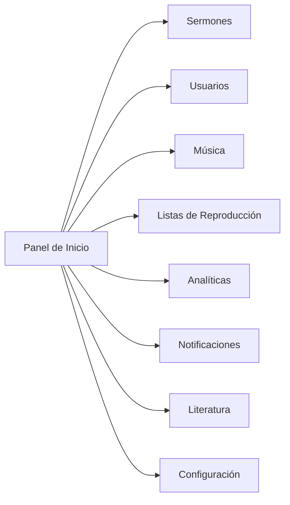
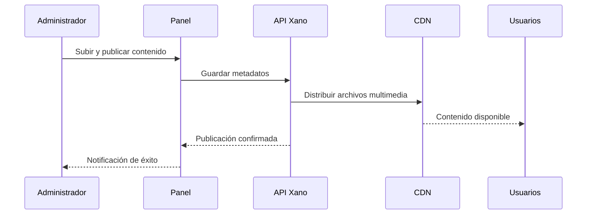

# Guía del Administrador de la Iglesia

Bienvenido a la guía de administración de Christ Gospel Church. Esta página cubre todo lo que necesitas saber para gestionar el contenido, los usuarios y las configuraciones de tu iglesia a través del Panel de Administración de CGC.

## Acceder al Panel de Administración

El Panel de Administración está disponible en [admin.christgospel.org](https://admin.christgospel.org).

### Cómo iniciar sesión

1. Visita [admin.christgospel.org](https://admin.christgospel.org)
2. Ingresa tu **dirección de correo electrónico** y **contraseña**
3. Haz clic en **Iniciar Sesión**
4. Si tienes la autenticación de dos factores habilitada, ingresa tu código de verificación cuando se te solicite
5. Serás llevado a la pantalla de inicio del panel

::: info
Las cuentas de administrador son creadas por los administradores existentes de tu iglesia. Si necesitas acceso de administrador, contacta al equipo de administración de tu iglesia o envía un correo a **support@christgospel.org**.
:::

### Configuración inicial

Cuando recibas tu invitación de administrador por primera vez:

1. Revisa tu correo electrónico para encontrar la invitación de CGC
2. Haz clic en el enlace del correo para establecer tu contraseña
3. Inicia sesión en [admin.christgospel.org](https://admin.christgospel.org)
4. Es posible que se te solicite configurar la **autenticación de dos factores** para mayor seguridad (altamente recomendado)
5. Completa tu perfil agregando tu nombre y cualquier otro detalle requerido

---

## Resumen del Panel

*Diagrama: Mapa de navegación del panel de administración*

Después de iniciar sesión, verás el panel principal con una barra de navegación lateral a la izquierda. Aquí tienes un resumen rápido de las secciones principales:

- **Inicio** — Una vista resumida con estadísticas rápidas, actividad reciente y accesos directos a tareas comunes
- **Sermones** — Subir, editar, programar y gestionar sermones
- **Música** — Gestionar canciones, álbumes, artistas y géneros
- **Literatura** — Gestionar libros y contenido escrito
- **Listas de Reproducción** — Crear y gestionar listas de reproducción destacadas y curadas
- **Usuarios** — Ver y gestionar cuentas de usuario, roles y permisos
- **Analíticas** — Ver reportes de uso, estadísticas de transmisión y datos de interacción
- **Notificaciones** — Enviar notificaciones push a tu congregación
- **Configuración** — Configurar ajustes de la aplicación, gestionar tu perfil y acceder a opciones de seguridad
- **Cita del Día** — Establecer citas inspiracionales diarias
- **Sermón de la Semana** — Seleccionar el sermón destacado de la semana

---

*Diagrama: Flujo de publicación de contenido*

## Gestionar Sermones

Los sermones son el núcleo de la plataforma de CGC. Como administrador, puedes subir, editar, programar y organizar sermones para tu congregación.

### Subir un nuevo sermón

1. Ve a **Sermones** en la barra lateral
2. Haz clic en **Agregar Sermón** (o el botón **+**)
3. Completa los detalles del sermón:
   - **Título** — El nombre del sermón
   - **Predicador** — Selecciona el predicador del menú desplegable, o agrega uno nuevo
   - **Fecha** — La fecha en que se predicó el sermón
   - **Tema / Categoría** — Asigna uno o más temas para ayudar a los usuarios a encontrar el sermón
   - **Referencia Bíblica** — Agrega cualquier referencia bíblica relevante
   - **Descripción** — Un breve resumen del contenido del sermón
4. Sube el **archivo de audio** (se recomienda formato MP3)
5. Opcionalmente sube un **archivo de video** (se recomienda formato MP4)
6. Haz clic en **Guardar** o **Publicar**

### Editar un sermón

1. Ve a **Sermones** y encuentra el sermón que quieres editar
2. Haz clic en el título del sermón o en el botón **Editar**
3. Realiza los cambios en cualquiera de los campos
4. Haz clic en **Guardar** para aplicar los cambios

### Programar un sermón para publicación futura

1. Mientras creas o editas un sermón, busca el campo **Fecha de Publicación**
2. Establece la fecha y hora en que quieres que el sermón esté disponible
3. Haz clic en **Programar** — el sermón se publicará automáticamente en el horario programado
4. Los sermones programados se marcan con un ícono de reloj en la lista de sermones

### Despublicar o eliminar un sermón

- Para **despublicar**: Edita el sermón y cambia su estado a **Borrador**. Se ocultará de los usuarios pero no se eliminará.
- Para **eliminar**: Haz clic en el botón **Eliminar** en el sermón. Se te pedirá confirmar. Los sermones eliminados no se pueden recuperar.

::: tip
Si no estás seguro de si eliminar un sermón, despublícalo primero. Siempre puedes volver a publicarlo más tarde.
:::

---

## Gestionar Usuarios

La sección de Usuarios te permite ver todos los usuarios registrados, gestionar roles e invitar nuevos administradores.

### Ver usuarios

1. Ve a **Usuarios** en la barra lateral
2. Verás una lista de todos los usuarios registrados
3. Usa la **barra de búsqueda** para encontrar un usuario específico por nombre o correo electrónico
4. Haz clic en un usuario para ver su perfil, estado de suscripción y actividad

### Roles y permisos de usuario

La plataforma de CGC tiene los siguientes roles:

| Rol | Descripción |
|---|---|
| **Usuario** | Miembro estándar. Puede explorar contenido, reproducir, crear listas de reproducción y gestionar su propia cuenta |
| **Suscriptor** | Un usuario con suscripción activa. Tiene acceso a funciones premium como descargas offline |
| **Administrador** | Acceso completo al Panel de Administración. Puede gestionar contenido, usuarios y configuraciones |
| **Super Administrador** | Todos los privilegios de administrador más la capacidad de gestionar otras cuentas de administrador y acceder a configuraciones sensibles |

### Invitar un nuevo administrador

1. Ve a **Usuarios** en la barra lateral
2. Haz clic en **Invitar Administrador**
3. Ingresa la **dirección de correo electrónico** de la persona
4. Selecciona el **rol** que quieres asignar (Administrador o Super Administrador)
5. Haz clic en **Enviar Invitación**
6. La persona recibirá un correo con instrucciones para configurar su cuenta

### Cambiar el rol de un usuario

1. Ve a **Usuarios** y encuentra al usuario
2. Haz clic en su perfil
3. Haz clic en **Editar Rol**
4. Selecciona el nuevo rol del menú desplegable
5. Haz clic en **Guardar**

::: warning
Ten cuidado al otorgar roles de Administrador o Super Administrador. Solo los miembros confiables del equipo deben tener acceso elevado.
:::

---

## Gestionar Música

La sección de Música te permite gestionar canciones, álbumes, artistas y géneros disponibles en la plataforma.

### Agregar una canción

1. Ve a **Música** en la barra lateral
2. Haz clic en **Agregar Canción**
3. Completa los detalles de la canción:
   - **Título** — El nombre de la canción
   - **Artista** — Selecciona un artista existente o crea uno nuevo
   - **Álbum** — Asigna la canción a un álbum (opcional)
   - **Género** — Selecciona el género
   - **Duración** — Se detectará automáticamente del archivo subido
4. Sube el **archivo de audio**
5. Haz clic en **Guardar** o **Publicar**

### Gestionar álbumes

1. Ve a **Música > Álbumes**
2. Haz clic en **Agregar Álbum** para crear un nuevo álbum
3. Ingresa el **título del álbum**, **artista**, **año de lanzamiento** y **arte de portada**
4. Agrega canciones al álbum seleccionando de canciones existentes o subiendo nuevas
5. Organiza el orden de las canciones arrastrando y soltando
6. Haz clic en **Guardar**

### Gestionar artistas

1. Ve a **Música > Artistas**
2. Haz clic en **Agregar Artista** para crear un nuevo perfil de artista
3. Ingresa el **nombre del artista**, **biografía** y sube una **foto** (opcional)
4. Haz clic en **Guardar**

---

## Gestionar Listas de Reproducción

Las listas de reproducción te permiten curar colecciones de sermones y música para tu congregación.

### Crear una lista de reproducción destacada

1. Ve a **Listas de Reproducción** en la barra lateral
2. Haz clic en **Crear Lista de Reproducción**
3. Ingresa un **título** y **descripción** para la lista
4. Agrega contenido buscando y seleccionando sermones o canciones
5. Organiza el orden arrastrando y soltando los elementos
6. Activa **Destacada** para que aparezca prominentemente en la aplicación
7. Haz clic en **Guardar**

### Editar el orden de la lista

1. Abre la lista que quieres editar
2. Arrastra y suelta los elementos para reorganizarlos
3. Haz clic en **Guardar** para actualizar el orden

### Eliminar elementos de una lista

1. Abre la lista
2. Haz clic en el botón **Eliminar** (ícono X) junto al elemento que quieres eliminar
3. Haz clic en **Guardar**

---

## Gestionar Literatura

La sección de Literatura te permite gestionar libros y contenido escrito disponible en la plataforma.

### Agregar un libro

1. Ve a **Literatura** en la barra lateral
2. Haz clic en **Agregar Libro**
3. Completa los detalles del libro:
   - **Título** — El nombre del libro
   - **Autor** — Selecciona o agrega al autor
   - **Descripción** — Un breve resumen o descripción
   - **Imagen de Portada** — Sube una imagen de portada
   - **Categoría** — Asigna una categoría
4. Sube el contenido del libro (PDF o formato compatible)
5. Haz clic en **Guardar** o **Publicar**

### Editar o eliminar literatura

- Para **editar**: Haz clic en el título del libro y actualiza cualquier campo, luego haz clic en **Guardar**
- Para **despublicar**: Cambia el estado a **Borrador**
- Para **eliminar**: Haz clic en **Eliminar** y confirma

---

## Analíticas y Reportes

La sección de Analíticas proporciona información sobre cómo tu congregación usa la plataforma.

### Reportes disponibles

- **Resumen** — Total de usuarios, usuarios activos, nuevos registros y cantidad de suscriptores
- **Transmisión** — Sermones más reproducidos, horas totales de escucha, horarios de mayor uso
- **Descargas** — Contenido más descargado, total de descargas, uso de almacenamiento
- **Suscripciones** — Suscriptores activos, nuevas suscripciones, cancelaciones, resumen de ingresos
- **Interacción** — Duración promedio de sesión, días más activos, categorías de contenido populares

### Ver reportes

1. Ve a **Analíticas** en la barra lateral
2. Selecciona el tipo de reporte de las pestañas en la parte superior
3. Usa el **selector de rango de fechas** para filtrar datos por período
4. Los reportes se pueden ver como gráficos o tablas
5. Haz clic en **Exportar** para descargar los datos del reporte como archivo CSV

---

## Notificaciones Push

Envía notificaciones push para mantener a tu congregación informada sobre nuevo contenido, eventos y anuncios.

### Enviar una notificación

1. Ve a **Notificaciones** en la barra lateral
2. Haz clic en **Nueva Notificación**
3. Ingresa el **título** (corto y llamativo)
4. Ingresa el **cuerpo del mensaje** (mantenlo conciso — menos de 200 caracteres funciona mejor)
5. Elige la **audiencia**:
   - **Todos los usuarios** — Enviar a todos
   - **Solo suscriptores** — Enviar solo a usuarios con suscripciones activas
   - **Segmento personalizado** — Selecciona grupos específicos si están disponibles
6. Opcionalmente establece un **enlace profundo** — esto determina a dónde van los usuarios cuando tocan la notificación (por ejemplo, un sermón específico o página de anuncios)
7. Elige **enviar inmediatamente** o **programar** para una fecha y hora futuras
8. Revisa y haz clic en **Enviar**

::: tip
Usa las notificaciones push con criterio. Enviar demasiadas notificaciones puede hacer que los usuarios las desactiven. Apunta a mensajes significativos y oportunos.
:::

---

## Cita del Día

La función Cita del Día muestra un mensaje inspiracional a los usuarios cuando abren la aplicación.

### Gestionar citas

1. Ve a **Cita del Día** en la barra lateral
2. Verás una vista de calendario o lista de citas próximas
3. Haz clic en **Agregar Cita** para crear una nueva
4. Ingresa el **texto de la cita** y el **autor/fuente**
5. Selecciona la **fecha** en que debe mostrarse
6. Haz clic en **Guardar**

### Consejos para las citas

- Prepara citas con anticipación para que siempre haya un mensaje fresco
- Usa referencias de las Escrituras, frases inspiracionales o pasajes de líderes de la iglesia
- Mantén las citas concisas — deben ser fáciles de leer de un vistazo

---

## Sermón de la Semana

La función Sermón de la Semana destaca un sermón en la pantalla de inicio de la aplicación cada semana.

### Seleccionar el sermón de la semana

1. Ve a **Sermón de la Semana** en la barra lateral
2. Explora o busca el sermón que quieres destacar
3. Selecciónalo y elige la **semana** en que debe ser destacado
4. Haz clic en **Guardar**

El sermón seleccionado aparecerá prominentemente en la pantalla de inicio durante la semana elegida, facilitando que los miembros lo encuentren.

---

## Resumen de Gestión de Suscripciones

Mientras los usuarios individuales gestionan sus propias suscripciones, los administradores pueden ver datos de suscripción y ayudar con problemas relacionados con las cuentas.

### Qué pueden ver los administradores

- Número total de suscriptores activos
- Distribución de planes de suscripción (qué planes son más populares)
- Cambios recientes de suscripción (nuevos, cancelados, expirados)
- Resúmenes de ingresos y tendencias

### Qué pueden hacer los administradores

- Ver el estado de suscripción de un usuario desde su perfil
- Dirigir a los usuarios a [subscriptions.christgospel.org](https://subscriptions.christgospel.org) para la gestión autónoma
- Escalar problemas de facturación a **support@christgospel.org**

::: info
Por razones de seguridad, los administradores no pueden ver ni modificar los datos de pago. Toda la información de pago se maneja de forma segura a través de Stripe.
:::

---

## Mejores Prácticas de Seguridad

Como administrador, tienes acceso a datos sensibles y herramientas de gestión. Sigue estas prácticas para mantener tu cuenta y la plataforma seguras.

### Seguridad de la cuenta

- **Usa una contraseña fuerte y única** — Evita reutilizar contraseñas de otros sitios. Usa una combinación de letras, números y símbolos.
- **Habilita la autenticación de dos factores** — Esto agrega una capa extra de protección. Ve a **Perfil > Seguridad** para configurarla.
- **Guarda tus códigos de respaldo** — Cuando configures 2FA, recibirás códigos de respaldo. Guárdalos en un lugar seguro en caso de que pierdas acceso a tu método de verificación.
- **No compartas tus credenciales** — Cada administrador debe tener su propia cuenta. Nunca compartas datos de inicio de sesión.

### Gestión de contenido

- **Revisa antes de publicar** — Verifica los detalles del sermón, información de canciones y metadatos de libros antes de hacer público el contenido
- **Usa la programación** — Cuando sea posible, programa contenido con anticipación en lugar de publicar inmediatamente, para poder revisar y detectar errores
- **Despublica en lugar de eliminar** — Si necesitas retirar contenido temporalmente, despublícalo en lugar de eliminarlo. La eliminación es permanente.

### Gestión de usuarios

- **Limita el acceso de administrador** — Solo otorga roles de administrador a personas que lo necesiten
- **Revisa las cuentas de administrador regularmente** — Elimina el acceso de miembros del equipo que ya no lo necesiten
- **Monitorea la actividad** — Revisa la sección de Analíticas periódicamente en busca de actividad inusual

### Consejos generales

- **Mantén tu navegador actualizado** — Un navegador actualizado ayuda a proteger contra vulnerabilidades de seguridad
- **Cierra sesión cuando termines** — Especialmente en computadoras compartidas o públicas
- **Reporta actividad sospechosa** — Si notas algo inusual, contacta a **support@christgospel.org** inmediatamente

---

## ¿Necesitas Ayuda?

Si tienes preguntas sobre el uso del Panel de Administración o necesitas soporte técnico, contáctanos en **support@christgospel.org**. Estamos felices de ayudarte a aprovechar al máximo la plataforma.
