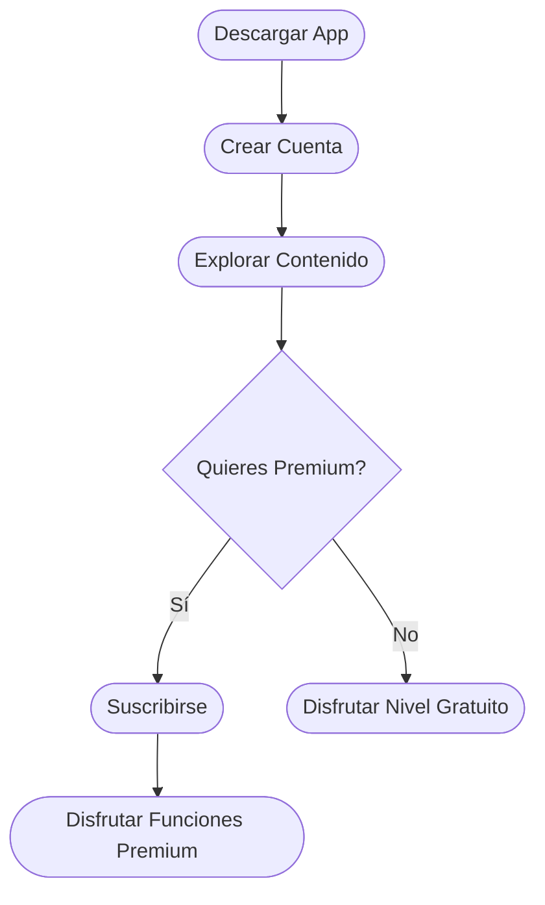

# Primeros Pasos

¡Bienvenido a la plataforma digital de Christ Gospel Church! Ya sea que estés aquí para escuchar sermones, mantenerte conectado con tu comunidad eclesiástica o gestionar tu suscripción, nos alegra que estés aquí.

*Diagrama: Recorrido de incorporación del usuario*

## Qué Puedes Hacer

Con la plataforma de CGC, puedes:

- **Escuchar sermones** — Navega por una biblioteca creciente de sermones por predicador, tema o fecha, y reprodúcelos en cualquier momento
- **Descargar para escuchar offline** — Guarda sermones en tu dispositivo para escuchar sin conexión a internet
- **Crear listas de reproducción** — Organiza tus sermones favoritos en listas personalizadas
- **Recibir notificaciones** — Recibe notificaciones push cuando haya nuevo contenido disponible
- **Elegir tu idioma** — Usa la aplicación en inglés o español
- **Gestionar tu suscripción** — Suscríbete, actualiza tu método de pago y consulta tu historial de facturación

## Paso 1: Descarga la Aplicación Móvil

La aplicación de CGC está disponible para iOS y Android:

- **iPhone / iPad**: Descárgala desde la [App Store](https://apps.apple.com)
- **Android**: Descárgala desde [Google Play](https://play.google.com)

La aplicación es gratuita. Una suscripción desbloquea funciones premium como descargas offline.

## Paso 2: Crea Tu Cuenta

1. Abre la aplicación de CGC después de descargarla
2. Toca **Crear Cuenta**
3. Ingresa tu **nombre**, **dirección de correo electrónico** y elige una **contraseña**
4. Revisa tu correo electrónico y toca el **enlace de verificación** para confirmar tu cuenta
5. Regresa a la aplicación e **inicia sesión**

Para una guía detallada, incluyendo cuentas de administrador y autenticación de dos factores, consulta la [Guía de Inicio de Sesión](/es/help/login-guide).

## Paso 3: Comienza a Explorar

Una vez que hayas iniciado sesión, aquí hay algunas cosas que puedes probar:

- **Explorar sermones**: Ve a la biblioteca de sermones y explora por predicador, tema o fecha
- **Reproducir un sermón**: Toca cualquier sermón para comenzar a escuchar de inmediato
- **Configurar tu perfil**: Ve a **Configuración > Perfil** para personalizar tu cuenta
- **Suscríbete**: Visita [subscriptions.christgospel.org](https://subscriptions.christgospel.org) para desbloquear funciones premium como descargas offline y compartir en familia

## Para Administradores de la Iglesia

Si eres administrador de la iglesia, también tienes acceso al **Panel de Administración**:

1. Visita [admin.christgospel.org](https://admin.christgospel.org)
2. Inicia sesión con tus credenciales de administrador
3. Si se te solicita, ingresa el código de verificación enviado a tu dispositivo
4. Serás redirigido al panel donde puedes gestionar sermones, usuarios y configuraciones

Las cuentas de administrador son creadas por el equipo de administración de tu iglesia. Contacta a **support@christgospel.org** si necesitas acceso de administrador.

## Guías Útiles

Aquí hay algunas guías para ayudarte a aprovechar al máximo la plataforma:

- [Guía de Inicio de Sesión](/es/help/login-guide) — Creación de cuentas, contraseñas y autenticación de dos factores
- [Gestionar Suscripción](/es/help/manage-subscription) — Planes, facturación, compartir en familia y cancelaciones
- [Descargas y Offline](/es/help/offline-downloads) — Descarga de sermones y gestión de almacenamiento
- [Preguntas Frecuentes](/es/help/faq) — Respuestas a preguntas comunes
- [Solución de Problemas](/es/help/troubleshooting) — Soluciones a problemas técnicos comunes

## ¿Necesitas Ayuda?

Estamos aquí para ti. Si tienes alguna pregunta o encuentras algún problema:

- Consulta las [Preguntas Frecuentes](/es/help/faq) para respuestas rápidas
- Revisa [Solución de Problemas](/es/help/troubleshooting) para ayuda técnica
- Contacta a soporte en **support@christgospel.org**
