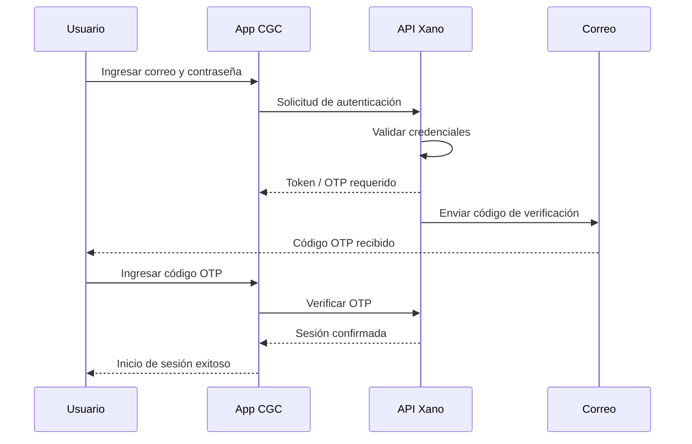
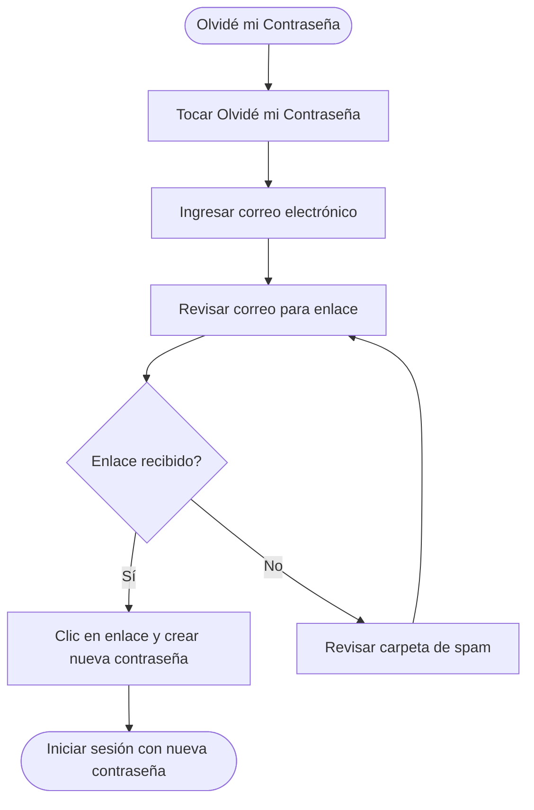

# Guía de Inicio de Sesión

Esta guía te llevará paso a paso por la creación de una cuenta, el inicio de sesión, el restablecimiento de tu contraseña y la solución de problemas comunes de acceso.

*Diagrama: Flujo de autenticación de inicio de sesión*

## Crear una Cuenta

### Aplicación Móvil

1. Descarga la aplicación de CGC desde la [App Store](https://apps.apple.com) (iOS) o [Google Play](https://play.google.com) (Android)
2. Abre la aplicación y toca **Crear Cuenta**
3. Ingresa tu **nombre completo**, **dirección de correo electrónico** y elige una **contraseña**
4. Recibirás un correo de verificación — ábrelo y toca el enlace **Verificar Correo Electrónico**
5. Regresa a la aplicación e inicia sesión con tus nuevas credenciales
6. ¡Listo! Ahora puedes explorar sermones, descubrir contenido y configurar tu perfil

### Panel de Administración

Las cuentas de administrador son creadas por el equipo de administración de tu iglesia. Si necesitas acceso de administrador:

1. Contacta al administrador de tu iglesia o envía un correo a **support@christgospel.org**
2. Una vez que tu cuenta sea creada, recibirás un correo de invitación
3. Haz clic en el enlace del correo para establecer tu contraseña
4. Visita el [Panel de Administración](https://admin.christgospel.org) e inicia sesión
5. Es posible que se te pida configurar la autenticación de dos factores en tu primer inicio de sesión (ver abajo)

## Cómo Iniciar Sesión

### Aplicación Móvil

1. Abre la aplicación de CGC en tu dispositivo
2. Toca **Iniciar Sesión**
3. Ingresa tu **dirección de correo electrónico** y **contraseña**
4. Toca **Iniciar Sesión** — serás llevado a la pantalla de inicio

### Panel de Administración

1. Visita [admin.christgospel.org](https://admin.christgospel.org)
2. Ingresa tu **dirección de correo electrónico** y **contraseña**
3. Haz clic en **Iniciar Sesión**
4. Si tienes la autenticación de dos factores habilitada, ingresa el código de verificación enviado a tu correo electrónico o dispositivo
5. Serás redirigido a la pantalla de inicio del panel

## Cómo Restablecer Tu Contraseña

*Diagrama: Flujo de restablecimiento de contraseña*

Si olvidaste tu contraseña, puedes restablecerla en unos pocos pasos:

1. En la pantalla de inicio de sesión, toca o haz clic en **Olvidé mi Contraseña**
2. Ingresa la **dirección de correo electrónico** asociada con tu cuenta
3. Revisa tu correo electrónico para encontrar un enlace de restablecimiento de contraseña (asegúrate de revisar tu carpeta de spam/correo no deseado)
4. Haz clic en el enlace e ingresa una **nueva contraseña**
5. Regresa a la aplicación o al panel e inicia sesión con tu nueva contraseña

::: tip
El enlace de restablecimiento de contraseña expira después de **24 horas**. Si ha expirado, simplemente solicita uno nuevo.
:::

## Autenticación de Dos Factores (Usuarios Administradores)

Para mayor seguridad, los administradores de la iglesia pueden habilitar la autenticación de dos factores (2FA):

### Configurar 2FA

1. Inicia sesión en el [Panel de Administración](https://admin.christgospel.org)
2. Ve a **Perfil > Seguridad**
3. Haz clic en **Habilitar Autenticación de Dos Factores**
4. Elige tu método de verificación — **correo electrónico** o **aplicación autenticadora**
5. Sigue las instrucciones para completar la configuración
6. Guarda tus **códigos de respaldo** en un lugar seguro — estos pueden usarse si pierdes acceso a tu método de verificación

### Usar 2FA

1. Inicia sesión con tu correo electrónico y contraseña como siempre
2. Cuando se te solicite, ingresa el **código de verificación** de tu correo electrónico o aplicación autenticadora
3. Haz clic en **Verificar** para completar el inicio de sesión

## Solución de Problemas de Inicio de Sesión

### Error "Correo electrónico o contraseña inválidos"

- Verifica que tu dirección de correo electrónico esté escrita correctamente
- Asegúrate de que Bloq Mayús no esté activado
- Intenta restablecer tu contraseña usando los pasos anteriores

### Correo de verificación no recibido

- Revisa tu carpeta de **spam o correo no deseado**
- Asegúrate de haber ingresado la dirección de correo electrónico correcta
- Espera unos minutos — los correos a veces tardan un momento en llegar
- Si aún no lo has recibido, toca **Reenviar Correo de Verificación** en la pantalla de inicio de sesión

### Cuenta bloqueada

Si has ingresado una contraseña incorrecta demasiadas veces, tu cuenta puede estar temporalmente bloqueada por seguridad. Espera **15 minutos** e intenta de nuevo, o restablece tu contraseña.

### Código de dos factores no funciona

- Asegúrate de estar ingresando el código más reciente (los códigos expiran rápidamente)
- Verifica que el reloj de tu dispositivo esté configurado a la hora correcta
- Intenta usar uno de tus **códigos de respaldo**
- Si has perdido acceso a tu método de verificación, contacta a **support@christgospel.org**

## ¿Necesitas Más Ayuda?

Si aún tienes problemas para iniciar sesión, contáctanos en **support@christgospel.org** y con gusto te ayudaremos.
