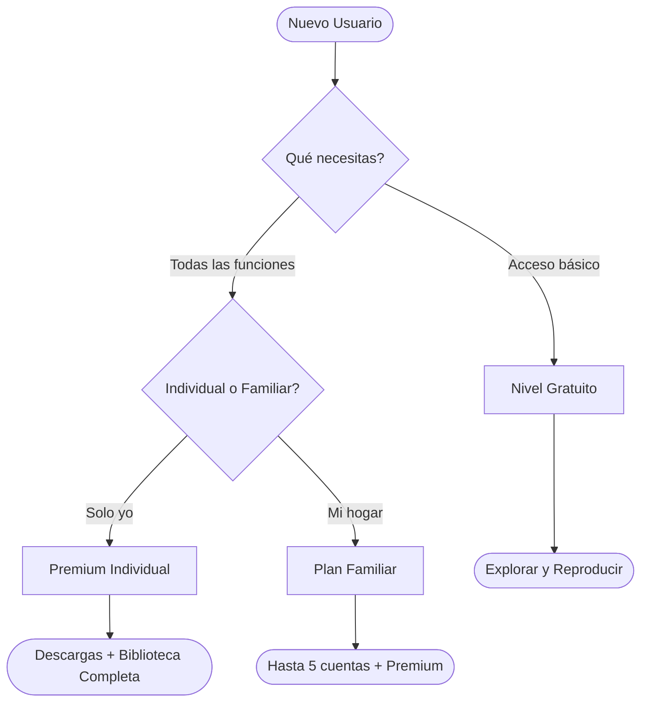
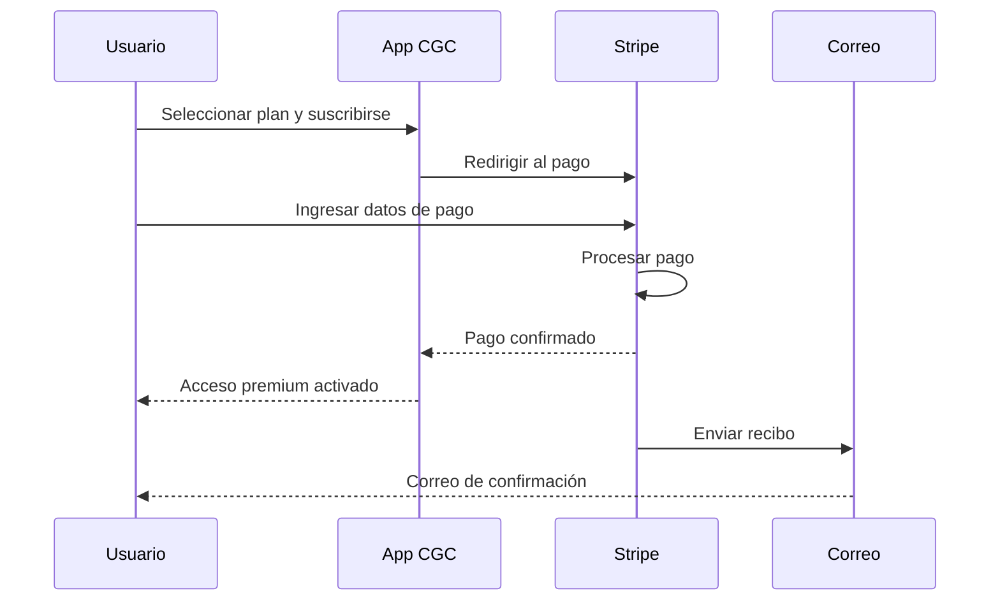

# Guía de Gestión de Suscripción

Esta guía cubre todo lo que necesitas saber sobre la gestión de tu suscripción de CGC, desde registrarte hasta actualizar tu información de pago.

*Diagrama: Árbol de decisión de suscripción*

*Diagrama: Flujo de pago*

## Cómo Suscribirse

1. Visita [subscriptions.christgospel.org](https://subscriptions.christgospel.org)
2. Explora los planes disponibles y selecciona el que sea mejor para ti
3. Haz clic en **Suscribirse** en el plan elegido
4. Si aún no has iniciado sesión, se te pedirá **iniciar sesión** o **crear una cuenta**
5. Serás dirigido a una página segura de pago de **Stripe**
6. Ingresa tu **información de pago** (tarjeta de crédito o débito)
7. Revisa tu pedido y haz clic en **Suscribirse**
8. Recibirás un **correo de confirmación** con los detalles de tu suscripción
9. Tus funciones premium ahora están activas — ¡disfrútalas!

::: tip
Todo el procesamiento de pagos es manejado por **Stripe**, una plataforma de pago confiable y compatible con PCI. La información de tu tarjeta nunca se almacena en nuestros servidores.
:::

## Cómo Ver el Historial de Facturación

1. Abre la aplicación de CGC o visita el panel web
2. Ve a **Configuración > Suscripción**
3. Toca o haz clic en **Historial de Facturación**
4. Verás una lista de todos los pagos anteriores, incluyendo fechas, montos y enlaces a recibos
5. Toca cualquier entrada para ver o descargar el recibo

Los recibos también se envían a tu correo electrónico después de cada pago.

## Cómo Actualizar Tu Método de Pago

1. Ve a **Configuración > Suscripción**
2. Toca o haz clic en **Método de Pago**
3. Haz clic en **Actualizar Tarjeta**
4. Ingresa los nuevos datos de tu tarjeta en el formulario seguro de Stripe
5. Haz clic en **Guardar** para confirmar el cambio

Tu nueva tarjeta se usará para todos los pagos futuros. La actualización surte efecto inmediatamente.

## Cómo Cancelar Tu Suscripción

1. Ve a **Configuración > Suscripción**
2. Toca o haz clic en **Cancelar Plan**
3. Se te pedirá confirmar — selecciona **Sí, Cancelar**
4. Tu suscripción permanece activa hasta el **final de tu período de facturación actual**
5. No se te cobrará de nuevo a menos que elijas re-suscribirte

::: info
Después de la cancelación, mantendrás acceso a los beneficios de tu suscripción hasta que termine el período de facturación. Después de eso, volverás al nivel gratuito y ya no podrás descargar contenido para uso offline.
:::

## Cómo Re-suscribirse Después de Cancelar

Si previamente cancelaste y quieres regresar:

1. Visita [subscriptions.christgospel.org](https://subscriptions.christgospel.org)
2. Inicia sesión con tu cuenta existente
3. Elige un plan y completa el proceso de pago
4. Tu acceso premium se restaurará inmediatamente

Tu historial de cuenta, listas de reproducción y preferencias se conservan — retomarás justo donde lo dejaste.

## Detalles del Plan Familiar

Los planes familiares te permiten compartir tu suscripción con los miembros de tu hogar:

- **Qué incluye**: Un plan familiar cubre a un titular de cuenta principal y hasta **4 miembros familiares adicionales**
- **Cómo funciona**: Cada miembro de la familia obtiene su propia cuenta individual con sus propias listas de reproducción y preferencias
- **Cómo configurarlo**: Suscríbete al plan Familiar en [subscriptions.christgospel.org](https://subscriptions.christgospel.org), luego ve a **Configuración > Suscripción > Miembros de la Familia** para invitar a tu familia por correo electrónico
- **Gestionar miembros**: El titular de cuenta principal puede agregar o eliminar miembros de la familia en cualquier momento desde la configuración de suscripción

::: tip
Cada miembro de la familia necesita su propia cuenta de CGC. Cuando los invites, recibirán un correo electrónico para iniciar sesión o crear una cuenta.
:::

## Política de Reembolso

- Las solicitudes de reembolso se pueden hacer dentro de los **7 días** posteriores a un pago
- Para solicitar un reembolso, contacta a **support@christgospel.org** con el correo de tu cuenta y el motivo de la solicitud
- Los reembolsos se procesan a tu método de pago original y generalmente aparecen dentro de **5-10 días hábiles**
- Si cancelas tu suscripción a mitad de ciclo, no se te cobrará de nuevo, pero el período actual no se reembolsa — mantienes el acceso hasta que termine

## ¿Necesitas Ayuda?

Para cualquier pregunta de facturación o problemas con la suscripción, contáctanos en **support@christgospel.org**. Incluye la dirección de correo electrónico asociada con tu cuenta para que podamos asistirte rápidamente.
