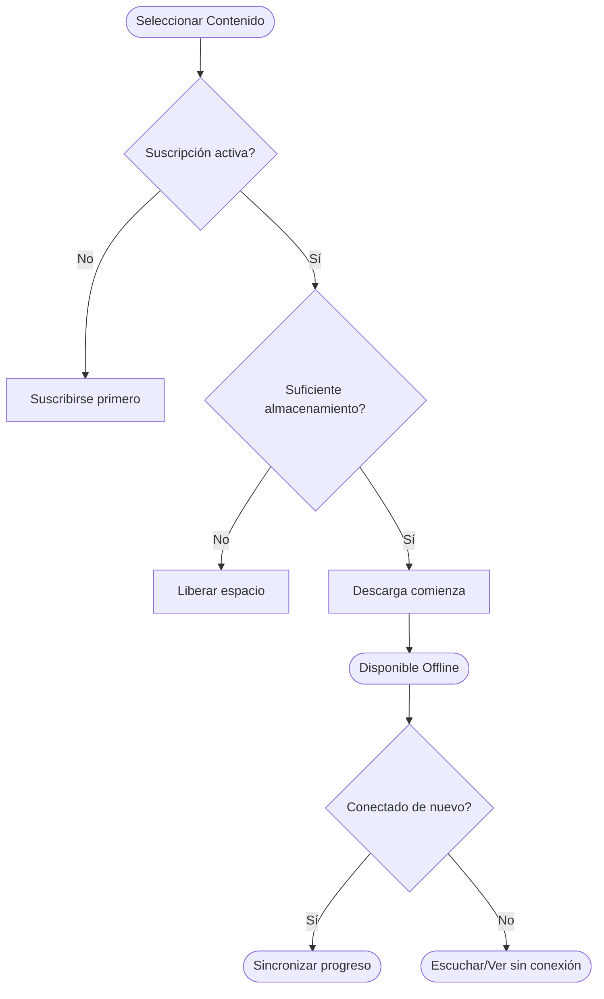

# Guía de Descargas y Offline

Con una suscripción activa, puedes descargar sermones para escuchar o ver en cualquier momento — incluso sin conexión a internet. Esta guía explica cómo descargar contenido, gestionar tus descargas y solucionar problemas comunes.

*Diagrama: Flujo del proceso de descarga*

## Cómo Descargar Sermones

1. Abre la aplicación de CGC en tu dispositivo móvil
2. Explora o busca el sermón que deseas descargar
3. Toca el botón **Descargar** (el ícono de flecha hacia abajo) en el sermón
4. La descarga comenzará — verás un indicador de progreso
5. Una vez completada, el sermón aparecerá en tu sección de **Descargas**

Puedes seguir usando la aplicación mientras el contenido se descarga en segundo plano.

::: info
Descargar sermones para acceso offline requiere una suscripción activa. Si estás en el nivel gratuito, se te pedirá suscribirte cuando toques el botón de descarga.
:::

## Acceder al Contenido Descargado

1. Abre la aplicación de CGC
2. Ve a la sección de **Descargas** desde el menú principal o la navegación inferior
3. Verás todos tus sermones descargados listados
4. Toca cualquier sermón para comenzar a escuchar o ver — no se necesita conexión a internet

Los sermones descargados están disponibles mientras tu suscripción esté activa.

## Gestionar el Contenido Descargado

### Ver el Tamaño de Descarga

Cada sermón descargado muestra su tamaño de archivo. Para ver cuánto almacenamiento total usan tus descargas:

1. Ve a **Configuración > Almacenamiento**
2. Verás el espacio total usado por el contenido descargado

### Requisitos de Almacenamiento

Los tamaños de descarga varían según el tipo de contenido:

| Tipo de Contenido | Tamaño Aproximado |
|---|---|
| Sermón de audio (30 min) | 15 - 25 MB |
| Sermón de audio (60 min) | 30 - 50 MB |
| Sermón de video (30 min) | 150 - 300 MB |
| Sermón de video (60 min) | 300 - 600 MB |

::: tip
Si el espacio de almacenamiento es una preocupación, considera descargar versiones solo de audio de los sermones. Usan significativamente menos espacio que las descargas de video.
:::

## Cómo Eliminar Descargas

### Eliminar una Sola Descarga

1. Ve a tu sección de **Descargas**
2. Desliza a la izquierda sobre el sermón que quieres eliminar (iOS) o mantén presionado y selecciona **Eliminar** (Android)
3. Confirma la eliminación

### Eliminar Todas las Descargas

1. Ve a **Configuración > Almacenamiento**
2. Toca **Borrar Todas las Descargas**
3. Confirma — todo el contenido descargado se eliminará de tu dispositivo

Eliminar una descarga solo la remueve de tu dispositivo. Siempre puedes descargarla de nuevo más tarde.

## Configuración de Descargas

Puedes personalizar cómo funcionan las descargas en **Configuración > Descargas**:

- **Descargar solo por Wi-Fi**: Cuando está habilitado, las descargas solo comenzarán cuando estés conectado a Wi-Fi. Esto ayuda a evitar usar tus datos móviles. Habilitado por defecto.
- **Calidad de audio**: Elige entre calidad Estándar y Alta para descargas de audio.
- **Calidad de video**: Elige entre Estándar (SD) y Alta (HD) para descargas de video. Mayor calidad significa archivos más grandes.

## Solución de Problemas de Descargas

### La descarga no inicia

- Verifica tu **conexión a internet** — las descargas requieren una conexión activa para comenzar
- Asegúrate de tener una **suscripción activa**
- Verifica que tengas suficiente **espacio de almacenamiento** en tu dispositivo
- Si "Solo Wi-Fi" está habilitado, asegúrate de estar conectado a Wi-Fi

### La descarga está detenida o es muy lenta

- Verifica la velocidad de tu conexión a internet
- Pausa y reanuda la descarga tocando el indicador de progreso
- Si el problema persiste, cancela la descarga e intenta de nuevo
- Intenta cambiar entre Wi-Fi y datos móviles (si "Solo Wi-Fi" está deshabilitado)

### El contenido descargado no se reproduce

- Asegúrate de que la descarga se completó exitosamente (busca un ícono de marca de verificación)
- Intenta eliminar la descarga y volver a descargarla
- Actualiza la aplicación a la última versión
- Reinicia la aplicación

### Las descargas desaparecieron

- Las descargas están vinculadas a tu cuenta — asegúrate de haber iniciado sesión
- Si tu suscripción ha expirado, el contenido descargado puede no estar disponible hasta que te vuelvas a suscribir
- Si recientemente actualizaste o reinstalaste la aplicación, es posible que necesites volver a descargar tu contenido

## ¿Necesitas Ayuda?

Si estás experimentando problemas persistentes con las descargas, contáctanos en **support@christgospel.org** con detalles sobre tu dispositivo, versión de la aplicación y el problema que estás encontrando.
