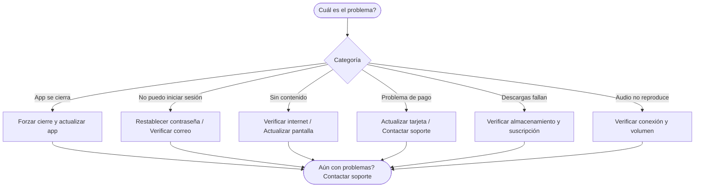

# Solución de Problemas

¿Tienes problemas? Esta guía cubre soluciones a problemas comunes en la aplicación móvil de CGC, el panel web y los servicios de suscripción. Encuentra tu problema abajo y sigue los pasos para resolverlo.

*Diagrama: Árbol de decisión de solución de problemas*

## Problemas de la Aplicación Móvil

### La aplicación no carga o se cierra al iniciar

1. **Fuerza el cierre** de la aplicación y vuelve a abrirla
2. **Verifica tu conexión** a internet
3. **Actualiza** a la última versión desde la App Store o Google Play
4. **Reinicia** tu dispositivo
5. Si el problema persiste, **desinstala y reinstala** la aplicación

::: warning
Reinstalar la aplicación eliminará cualquier contenido descargado. Puedes volver a descargar tus sermones después de iniciar sesión nuevamente.
:::

### La aplicación muestra una pantalla en blanco o blanca

Si la aplicación abre pero muestra una pantalla en blanco o blanca:

1. Espera un momento — la aplicación puede estar cargando contenido aún
2. Fuerza el cierre de la aplicación completamente y vuelve a abrirla
3. Verifica tu conexión a internet
4. Borra la caché de la aplicación (ver [Cómo borrar la caché de la aplicación](#como-borrar-la-cache-de-la-aplicacion-movil) abajo)
5. Actualiza a la última versión de la aplicación
6. Si el problema continúa, desinstala y reinstala la aplicación

### La aplicación funciona lenta o se congela

1. Cierra otras aplicaciones que se ejecuten en segundo plano para liberar memoria
2. Asegúrate de que tu dispositivo tenga al menos **500 MB** de espacio libre de almacenamiento
3. Borra la caché de la aplicación (ver instrucciones abajo)
4. Actualiza a la última versión de la aplicación
5. Reinicia tu dispositivo

### El contenido no se muestra

- Verifica tu conexión a internet
- Desliza hacia abajo para actualizar la pantalla
- Cierra sesión y vuelve a iniciar sesión
- Borra la caché de la aplicación

### Las notificaciones push no funcionan

- Ve a la **Configuración > Notificaciones** de tu dispositivo y asegúrate de que la aplicación de CGC tenga permiso para enviar notificaciones
- Asegúrate de haber iniciado sesión en la aplicación
- **iOS**: Ve a **Configuración > Notificaciones > CGC** y asegúrate de que **Permitir Notificaciones** esté activado. Verifica que los Banners, Sonidos y Insignias estén habilitados según lo desees
- **Android**: Ve a **Configuración > Aplicaciones > CGC > Notificaciones** y asegúrate de que las notificaciones estén habilitadas para todos los canales relevantes
- Verifica que el modo **No Molestar** no esté activo en tu dispositivo
- Asegúrate de que la aplicación tenga habilitada la **actualización en segundo plano** (iOS: Configuración > General > Actualización en Segundo Plano; Android: Configuración > Aplicaciones > CGC > Batería > Permitir actividad en segundo plano)
- Intenta cerrar sesión y volver a iniciar sesión para actualizar tu registro de notificaciones

### El audio o video no se reproduce

Si un sermón o archivo multimedia no se reproduce o el audio/video no carga:

1. Verifica tu conexión a internet — la transmisión requiere una conexión activa
2. Intenta pausar y reanudar la reproducción
3. Cierra y vuelve a abrir la aplicación, luego intenta de nuevo
4. Asegúrate de que el volumen de tu dispositivo esté encendido y no en silencio/mudo
5. Verifica que ninguna otra aplicación esté usando el audio actualmente (por ejemplo, aplicaciones de música o podcasts)
6. Si usas audífonos o bocina Bluetooth, desconéctalos e intenta reproducir por la bocina del dispositivo para descartar un problema de Bluetooth
7. Actualiza la aplicación a la última versión
8. Si estás reproduciendo un sermón descargado, intenta eliminarlo y volver a descargarlo

### El audio se reproduce pero se detiene inesperadamente o salta

- Asegúrate de que la **reproducción de audio en segundo plano** esté habilitada: ve a **Configuración > Reproducción** en la aplicación
- Verifica que la optimización de batería no esté deteniendo la aplicación en segundo plano (Android: Configuración > Aplicaciones > CGC > Batería > Sin restricciones)
- Asegúrate de tener una conexión a internet estable si estás transmitiendo
- Intenta descargar el sermón para reproducción offline para evitar interrupciones de transmisión

### Fallas en descargas

Si un sermón no se descarga o una descarga se queda atascada:

1. Verifica tu conexión a internet
2. Asegúrate de tener una **suscripción activa** — las descargas requieren un plan premium
3. Verifica que tengas suficiente **espacio de almacenamiento** en tu dispositivo
4. Si "Solo Wi-Fi" está habilitado en Configuración > Descargas, asegúrate de estar conectado a Wi-Fi
5. Cancela la descarga atascada e intenta de nuevo
6. Fuerza el cierre de la aplicación, vuelve a abrirla e intenta la descarga de nuevo
7. Si el problema persiste, borra la caché de la aplicación e intenta de nuevo

### Las descargas desaparecieron después de actualizar la aplicación

- Asegúrate de haber iniciado sesión con la misma cuenta
- Si recientemente actualizaste o reinstalaste la aplicación, las descargas pueden necesitar ser descargadas de nuevo
- Ve a la sección de **Descargas** para verificar si tu contenido aún está listado
- Si tu suscripción ha expirado, el contenido descargado puede no estar disponible

### Problemas de permisos de la aplicación

Si la aplicación pide permisos o una función no funciona debido a permisos:

- **Notificaciones**: Configuración > Notificaciones > CGC (iOS) o Configuración > Aplicaciones > CGC > Notificaciones (Android)
- **Almacenamiento/Fotos**: Necesario para guardar contenido. Configuración > Privacidad > Fotos (iOS) o Configuración > Aplicaciones > CGC > Permisos > Almacenamiento (Android)
- **Actualización en Segundo Plano**: Necesario para descargas y reproducción de audio en segundo plano. Configuración > General > Actualización en Segundo Plano > CGC (iOS) o Configuración > Aplicaciones > CGC > Batería (Android)

::: tip
Si previamente denegaste un permiso, necesitarás habilitarlo manualmente en la configuración de tu dispositivo. La aplicación no puede volver a solicitarlo una vez que un permiso ha sido denegado.
:::

### Cómo borrar la caché de la aplicación (móvil) {#como-borrar-la-cache-de-la-aplicacion-movil}

Borrar la caché puede resolver muchos problemas de visualización y rendimiento sin afectar tu cuenta ni tus descargas.

**iOS:**
1. Ve a la **Configuración > General > Almacenamiento del iPhone** del dispositivo
2. Encuentra la aplicación **CGC** en la lista
3. Toca **Liberar la App** — esto borra la caché mientras conserva tus datos
4. Toca **Reinstalar App** para restaurarla

**Android:**
1. Ve a la **Configuración > Aplicaciones > CGC** del dispositivo
2. Toca **Almacenamiento y caché**
3. Toca **Borrar caché** (no "Borrar datos" — eso eliminaría tus descargas)

---

## Problemas del Panel Web

### No puedo iniciar sesión

- Verifica que tu dirección de correo electrónico sea correcta
- Usa "Olvidé mi Contraseña" para restablecer tus credenciales
- Borra la caché y cookies de tu navegador
- Prueba con un navegador diferente
- Asegúrate de que la tecla Bloq Mayús no esté activada
- Verifica si tu cuenta puede estar bloqueada (ver [Cuenta bloqueada o suspendida](#cuenta-bloqueada-o-suspendida) abajo)

### La página muestra una pantalla en blanco

- Actualización forzada: `Ctrl+Shift+R` (Windows) o `Cmd+Shift+R` (Mac)
- Borra la caché y cookies del navegador
- Deshabilita temporalmente las extensiones del navegador — los bloqueadores de anuncios y extensiones de privacidad a veces pueden interferir
- Intenta abrir la página en una ventana de **navegación privada/incógnito**
- Prueba con un navegador diferente

### Código de verificación de dos factores no recibido

- Revisa tu carpeta de spam/correo no deseado
- Espera hasta 60 segundos antes de solicitar un nuevo código
- Asegúrate de que tu correo electrónico/número de teléfono sea correcto en tu perfil
- Si usas una aplicación autenticadora, asegúrate de que el reloj de tu dispositivo esté configurado a la hora correcta (incluso una pequeña diferencia de tiempo puede causar que los códigos fallen)
- Intenta usar uno de tus **códigos de respaldo** si los guardaste durante la configuración de 2FA
- Si has perdido acceso completamente a tu método de verificación, contacta a **support@christgospel.org** para recuperar tu cuenta

### La autenticación de dos factores no funciona con la aplicación autenticadora

Si los códigos de tu aplicación autenticadora siguen siendo rechazados:

1. Abre la **Configuración > Fecha y Hora** de tu dispositivo y asegúrate de que esté configurada en **automático**
2. Si la hora es correcta, intenta actualizar el código e ingresarlo inmediatamente (los códigos expiran cada 30 segundos)
3. Asegúrate de estar usando la entrada correcta del autenticador para CGC — puedes tener múltiples entradas
4. Como alternativa, usa uno de tus **códigos de respaldo**
5. Contacta a **support@christgospel.org** si nada de lo anterior funciona

### Problemas de compatibilidad del navegador

El panel web de CGC funciona mejor en navegadores modernos. Recomendamos:

- **Google Chrome** (versión 90 o posterior)
- **Mozilla Firefox** (versión 90 o posterior)
- **Microsoft Edge** (versión 90 o posterior)
- **Safari** (versión 15 o posterior)

Si estás experimentando problemas:

- Actualiza tu navegador a la última versión
- Deshabilita extensiones del navegador que puedan interferir (bloqueadores de anuncios, herramientas de privacidad)
- Asegúrate de que JavaScript esté habilitado en la configuración de tu navegador
- Intenta borrar la caché y cookies, luego recarga la página

::: info
Internet Explorer no es compatible. Si estás usando IE, por favor cambia a un navegador moderno.
:::

### Cómo borrar la caché y cookies del navegador

**Chrome:**
1. Haz clic en el menú de tres puntos > **Configuración > Privacidad y seguridad > Borrar datos de navegación**
2. Selecciona **Imágenes y archivos en caché** y **Cookies y otros datos de sitios**
3. Haz clic en **Borrar datos**

**Firefox:**
1. Haz clic en el botón de menú > **Configuración > Privacidad y Seguridad**
2. En Cookies y Datos del Sitio, haz clic en **Limpiar Datos**
3. Marca ambas casillas y haz clic en **Limpiar**

**Safari:**
1. Haz clic en **Safari** en la barra de menú > **Configuración > Privacidad**
2. Haz clic en **Administrar datos de sitios web** > **Eliminar todo**

**Edge:**
1. Haz clic en el menú de tres puntos > **Configuración > Privacidad, búsqueda y servicios**
2. En Borrar datos de navegación, haz clic en **Elegir lo que se va a borrar**
3. Selecciona archivos en caché y cookies, luego haz clic en **Borrar ahora**

---

## Problemas de Cuenta

### Cuenta bloqueada o suspendida

Si tu cuenta está bloqueada después de demasiados intentos fallidos de inicio de sesión:

- Espera **15 minutos** e intenta de nuevo — las cuentas se bloquean temporalmente después de múltiples intentos incorrectos de contraseña
- Usa el enlace **Olvidé mi Contraseña** para restablecer tu contraseña
- Si tu cuenta parece estar suspendida o recibes un mensaje sobre suspensión de cuenta, contacta a **support@christgospel.org**

### No puedo verificar mi dirección de correo electrónico

Si no estás recibiendo el enlace de verificación de correo:

1. Revisa tu carpeta de **spam/correo no deseado**
2. Asegúrate de haber ingresado la dirección de correo correcta durante el registro
3. Espera unos minutos — los correos a veces pueden retrasarse
4. Intenta tocar **Reenviar Correo de Verificación** en la pantalla de inicio de sesión
5. Agrega **noreply@christgospel.org** a tus contactos de correo para prevenir filtrado futuro
6. Si usas un correo de trabajo o escuela, consulta con tu departamento de TI — algunos sistemas de correo bloquean mensajes automatizados

---

## Problemas de Suscripción y Pago

### La suscripción no se sincroniza entre dispositivos

Si tu suscripción aparece activa en un dispositivo pero no en otro:

1. Asegúrate de haber iniciado sesión con la **misma cuenta** en todos los dispositivos
2. Ve a **Configuración > Suscripción** y desliza hacia abajo para actualizar
3. Cierra sesión y vuelve a iniciar sesión en el dispositivo afectado
4. Espera unos minutos — el estado de la suscripción puede tardar un poco en sincronizarse
5. Si el problema persiste, contacta a **support@christgospel.org** con el correo de tu cuenta

### Pago rechazado

Si tu pago está siendo rechazado durante el pago o renovación:

1. Verifica que el número de tarjeta, fecha de vencimiento y CVV estén ingresados correctamente
2. Asegúrate de que tu tarjeta no haya expirado
3. Verifica que tengas fondos suficientes o crédito disponible
4. Contacta a tu banco o emisor de tarjeta — algunos bancos bloquean transacciones en línea por defecto y pueden necesitar autorizar el pago
5. Prueba con un método de pago diferente (una tarjeta diferente)
6. Si continúas con problemas, contacta a **support@christgospel.org**

### La suscripción expiró pero debería estar activa

- Revisa tu correo electrónico para notificaciones de pago fallido de Stripe
- Ve a **Configuración > Suscripción** y verifica el estado de tu plan
- Actualiza tu método de pago si tu tarjeta ha expirado o sido reemplazada
- Si tu pago falló, actualizar tu tarjeta puede reintentar automáticamente el cargo
- Contacta a **support@christgospel.org** si el estado de tu suscripción no se actualiza después de corregir el método de pago

### Problemas con el plan familiar

Si tienes problemas con un plan familiar:

- **Invitaciones no recibidas**: Pide al miembro de la familia que revise su carpeta de spam/correo no deseado. Asegúrate de que se ingresó la dirección de correo correcta al enviar la invitación.
- **No puede unirse al plan familiar**: El miembro de la familia debe tener su propia cuenta de CGC. Si no tiene una, debe crear una cuenta primero, luego aceptar la invitación del plan familiar.
- **Miembro de la familia perdió acceso**: El titular de la cuenta principal debe ir a **Configuración > Suscripción > Miembros de la Familia** y verificar que el miembro aún esté listado. Intenta eliminar y volver a invitarlo.
- **Se alcanzó el límite de miembros**: Los planes familiares soportan hasta **4 miembros adicionales** más el titular de la cuenta principal (5 en total). Si necesitas agregar a alguien nuevo, primero deberás eliminar a un miembro existente.

### Código promocional o cupón no funciona

- Asegúrate de estar ingresando el código exactamente como fue proporcionado, incluyendo mayúsculas o caracteres especiales
- Verifica la fecha de vencimiento — los códigos promocionales pueden tener un período de validez limitado
- Algunos códigos solo son válidos para planes específicos (por ejemplo, solo planes anuales)
- Los códigos promocionales generalmente solo se pueden usar una vez por cuenta
- Contacta a **support@christgospel.org** si crees que el código debería ser válido

---

## Problemas de Red y Conectividad

### La aplicación dice "Sin conexión a internet" pero estoy conectado

1. Intenta abrir un sitio web en tu navegador para confirmar que tu internet funciona
2. Activa y desactiva el **Modo Avión** para actualizar tu conexión
3. Cambia entre Wi-Fi y datos móviles para ver si uno funciona mejor
4. Reinicia tu router si estás en Wi-Fi
5. Fuerza el cierre de la aplicación y vuelve a abrirla
6. Reinicia tu dispositivo

### La transmisión tiene interrupciones o se detiene constantemente

- Verifica la velocidad de tu internet — la transmisión de audio requiere al menos **1 Mbps** y el video requiere al menos **5 Mbps**
- Acércate a tu router Wi-Fi si estás en una conexión inalámbrica
- Cierra otras aplicaciones o pestañas del navegador que puedan estar usando ancho de banda
- Intenta cambiar entre Wi-Fi y datos móviles
- Reduce la calidad de transmisión en **Configuración > Reproducción > Calidad de Transmisión** si está disponible
- Considera descargar el sermón para reproducción offline para evitar problemas de transmisión

---

## Problemas Específicos por Dispositivo

### Problemas específicos de iOS

- **Aplicación atascada en la pantalla de inicio**: Fuerza el cierre de la aplicación deslizando hacia arriba desde la parte inferior (o presionando dos veces el botón de Inicio) y deslizando la aplicación. Espera un momento, luego vuelve a abrirla.
- **Las notificaciones no aparecen**: Ve a Configuración > Notificaciones > CGC y asegúrate de que **Permitir Notificaciones** esté habilitado. Verifica que el estilo de notificación esté configurado en Banners o Alertas.
- **Advertencia de almacenamiento lleno**: Ve a Configuración > General > Almacenamiento del iPhone y libera aplicaciones no utilizadas. Considera eliminar sermones descargados más antiguos.
- **El audio en segundo plano se detiene cuando la pantalla se bloquea**: Ve a Configuración > General > Actualización en Segundo Plano y asegúrate de que CGC esté habilitado.

### Problemas específicos de Android

- **La aplicación se cierra después de actualizar**: Borra la caché de la aplicación en Configuración > Aplicaciones > CGC > Almacenamiento y caché > Borrar caché. Si eso no ayuda, desinstala y reinstala.
- **La optimización de batería cierra la aplicación**: Ve a Configuración > Aplicaciones > CGC > Batería y selecciona **Sin restricciones** (o el equivalente para el fabricante de tu dispositivo). Esto evita que Android detenga la aplicación en segundo plano.
- **Notificaciones retrasadas**: Algunos fabricantes de Android (Samsung, Xiaomi, Huawei, OnePlus) tienen optimización agresiva de batería que retrasa las notificaciones. Busca la configuración de batería del fabricante de tu dispositivo y agrega CGC a la lista de excepciones.
- **Ubicación de almacenamiento de descargas**: Las descargas se guardan en el almacenamiento interno de tu dispositivo por defecto. Si te estás quedando sin espacio, considera borrar descargas antiguas.

---

## Códigos de Error

Si ves un código de error en la aplicación o en el panel web, encuéntralo abajo para orientación.

| Código de Error | Significado | Solución |
|---|---|---|
| **ERR_NETWORK** | No se puede conectar al servidor | Verifica tu conexión a internet e intenta de nuevo |
| **ERR_AUTH_001** | Fallo de autenticación | Verifica tu correo y contraseña. Intenta restablecer tu contraseña |
| **ERR_AUTH_002** | Sesión expirada | Cierra sesión y vuelve a iniciar sesión |
| **ERR_AUTH_003** | Cuenta bloqueada | Espera 15 minutos o restablece tu contraseña |
| **ERR_SUB_001** | Se requiere suscripción | Esta función requiere una suscripción activa. Visita [subscriptions.christgospel.org](https://subscriptions.christgospel.org) |
| **ERR_SUB_002** | Suscripción expirada | Renueva tu suscripción para restaurar el acceso |
| **ERR_SUB_003** | Pago fallido | Actualiza tu método de pago en Configuración > Suscripción |
| **ERR_DL_001** | Descarga fallida | Verifica tu conexión a internet y espacio de almacenamiento, luego intenta de nuevo |
| **ERR_DL_002** | Almacenamiento insuficiente | Libera espacio en tu dispositivo e intenta de nuevo |
| **ERR_DL_003** | Descarga no disponible | Este contenido puede no estar disponible para descarga. Contacta a soporte si crees que es un error |
| **ERR_MEDIA_001** | Error de reproducción | Intenta cerrar y volver a abrir la aplicación. Si el problema persiste, vuelve a descargar el contenido |
| **ERR_MEDIA_002** | Transmisión no disponible | El contenido puede estar temporalmente no disponible. Intenta de nuevo más tarde |
| **ERR_SERVER_500** | Error del servidor | Este es un problema temporal de nuestro lado. Intenta de nuevo en unos minutos |
| **ERR_SERVER_503** | Mantenimiento del servicio | El servicio está en mantenimiento programado. Intenta de nuevo más tarde |

Si ves un código de error no listado aquí, contacta a soporte con el código de error y una descripción de lo que estabas haciendo cuando apareció el error.

---

## ¿Aún Necesitas Ayuda?

Si has intentado los pasos anteriores y aún experimentas un problema, estamos aquí para ayudar. Contáctanos en **support@christgospel.org** con:

- Una descripción del problema
- El **código de error** o **mensaje de error**, si existe
- Tu **dispositivo** (por ejemplo, iPhone 14, Samsung Galaxy S23) y **versión del sistema operativo**
- Tu **versión de la aplicación** (se encuentra en Configuración > Acerca de)
- Tu **navegador** nombre y versión (si usas el panel web)
- Capturas de pantalla o grabaciones de pantalla si es posible

Mientras más detalles proporciones, más rápido podremos ayudarte a resolver el problema.
