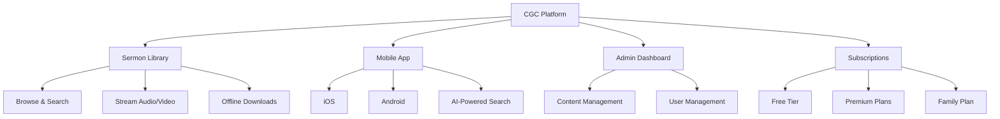

# Features

An overview of everything available in the CGC digital platform.

*Diagram: CGC platform feature overview*

## Sermon Library

Browse and stream sermons from our catalog of preachers. Filter by topic, date, or preacher. Download for offline listening.

## Mobile App

- Cross-platform (iOS and Android)
- Offline content support
- Push notifications for new content
- Bilingual interface (English/Spanish)

## Admin Dashboard

For church administrators:
- Sermon management (upload, schedule, categorize)
- User management and role assignment
- Subscription and payment oversight
- Media library management
- Security settings and access controls

## Subscriptions

- Multiple plan tiers
- Secure payment via Stripe
- Family plan options
- Easy management and cancellation
