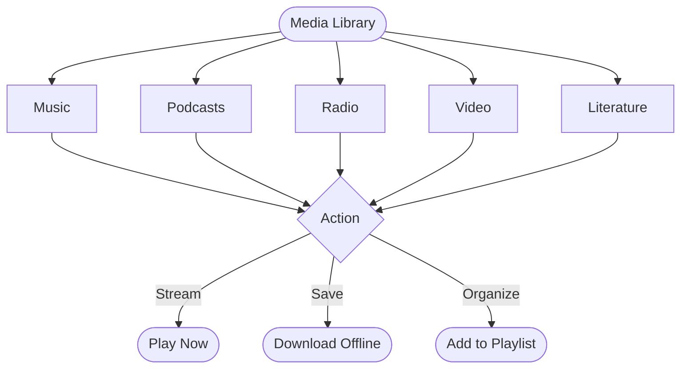

# Media Library

The CGC platform offers a rich media library that goes beyond sermons. From music and podcasts to books and curated playlists, there is a wide variety of content to explore and enjoy.

*Diagram: Media browsing flow*

## Music

The CGC music library features a growing collection of songs, albums, and artists from the Christ Gospel Church community.

### Browsing music

- **Songs** — Browse individual songs or use the search bar to find a specific track
- **Albums** — View complete albums with track listings and cover art
- **Artists** — Explore all songs and albums by a specific artist
- **Genres** — Filter music by genre to find the style you enjoy

### Listening to music

1. Navigate to the **Music** section in the app
2. Browse or search for a song, album, or artist
3. Tap a song to start playing it
4. Use the player controls to pause, skip, adjust volume, or scrub through the track
5. Music plays in the background so you can continue using the app or lock your screen

### Adding music to playlists

1. While viewing a song, tap the **three-dot menu** (or long-press the song)
2. Select **Add to Playlist**
3. Choose an existing playlist or create a new one
4. The song will be added to your playlist

---

## Podcasts and Radio

Stay connected with church content through podcasts and radio-style programming.

### Podcasts

- Browse available podcast series in the **Podcasts** section
- Each series contains multiple episodes organized chronologically
- Tap an episode to stream it, or download it for offline listening (subscription required)
- New episodes are added regularly — enable push notifications to be alerted when new content is available

### Radio

- The radio feature provides continuous streaming of curated content
- Tune in for a mix of sermons, music, and spoken-word programming
- No need to choose what to listen to — just hit play and enjoy

---

## Video Content

The CGC platform includes video sermons and other video content that you can stream directly in the app or browser.

### Watching videos

1. Browse the **video** content area or look for the video icon on sermons that have video available
2. Tap to start streaming
3. Videos play in the built-in player with standard controls (play, pause, seek, fullscreen, volume)
4. Rotate your device to landscape for a fullscreen viewing experience on mobile

### Video quality

- Videos are streamed in adaptive quality by default, adjusting to your internet speed
- For the best experience, use a strong Wi-Fi connection
- If you experience buffering, try lowering your streaming quality in **Settings > Playback**

### Downloading videos

- With an active subscription, you can download video sermons for offline viewing
- Video downloads are larger than audio (see the [Offline & Downloads Guide](/help/offline-downloads) for size estimates)
- Consider downloading over Wi-Fi to avoid using mobile data

---

## Playlists

Playlists let you organize your favorite sermons, songs, and other content into custom collections.

### Personal playlists

You can create as many personal playlists as you like:

1. Go to the **Playlists** section or tap the three-dot menu on any content item
2. Select **Add to Playlist**
3. Choose **Create New Playlist** and give it a name, or add to an existing playlist
4. Your playlists are saved to your account and available on all your devices

### Managing your playlists

- **Reorder items** — Open a playlist and drag items to rearrange the order
- **Remove items** — Swipe left on an item (iOS) or long-press and select Remove (Android)
- **Rename a playlist** — Tap the playlist title or the edit icon to change the name
- **Delete a playlist** — Open the playlist, tap the three-dot menu, and select **Delete Playlist**

### Featured playlists

The CGC team curates featured playlists that appear on the home screen and in the Playlists section. These are hand-picked collections organized around themes, events, or sermon series. Featured playlists are updated regularly.

### Sharing playlists

- You can share a playlist with others by tapping the **Share** button on the playlist
- A shareable link will be generated that the recipient can open in the app
- Shared playlists are read-only for the recipient — they can listen but not edit your playlist

---

## Literature and Books

The CGC platform includes a library of books and written content for reading and study.

### Browsing literature

- Go to the **Literature** or **Books** section in the app
- Browse by title, author, or category
- Use the search bar to find specific books

### Reading

1. Tap on a book to open it
2. The built-in reader allows you to read directly in the app
3. Use the controls to adjust text size, navigate between chapters, and bookmark pages
4. Your reading progress is saved automatically and syncs across devices

### Downloading books

- With an active subscription, you can download books for offline reading
- Downloaded books are available in the **Downloads** section along with your other offline content

---

## Content Availability

The CGC media library is regularly updated with new content. Here is a quick reference for what is available:

| Content Type | Streaming | Download (Offline) | Subscription Required for Download |
|---|---|---|---|
| Sermons (audio) | Yes | Yes | Yes |
| Sermons (video) | Yes | Yes | Yes |
| Music (songs) | Yes | Yes | Yes |
| Podcasts | Yes | Yes | Yes |
| Radio | Yes | No | No |
| Video content | Yes | Yes | Yes |
| Literature / Books | Yes | Yes | Yes |

::: info
Streaming is available to all users. Downloading content for offline access requires an active subscription.
:::

---

## Tips for Getting the Most Out of the Media Library

- **Use playlists** to organize content for different occasions — morning devotions, commute listening, study time
- **Enable push notifications** to know when new content is added
- **Download over Wi-Fi** to save mobile data and get faster downloads
- **Explore featured playlists** for curated collections you might not discover on your own
- **Try the AI search** to find content by describing what you are looking for in your own words (see [AI-Powered Features](/features/ai-features))

---

## Questions?

If you have suggestions for content you would like to see in the media library, or if you have trouble accessing any media, contact us at **support@christgospel.org**.
