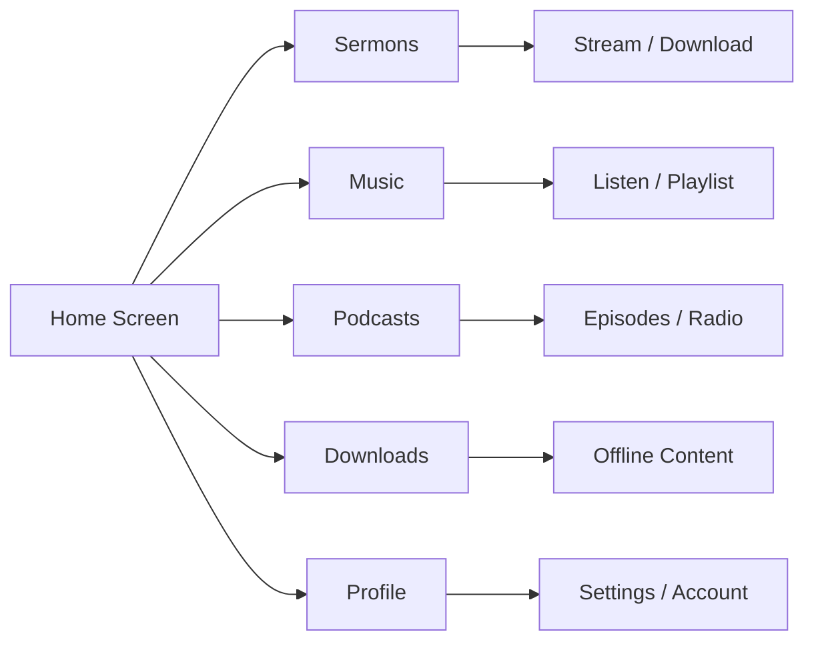

# Mobile App

The CGC mobile app brings the church to your pocket. Stream sermons, listen to music, read books, and stay connected with your congregation — all from your phone or tablet.

## Download the App

- **iOS (iPhone / iPad)**: Download from the [App Store](https://apps.apple.com)
- **Android**: Download from [Google Play](https://play.google.com)

The app is free to download. A subscription unlocks premium features like offline downloads and full media library access.

## Device Requirements

- **iOS**: Version 15.0 or later (iPhone, iPad, iPod touch)
- **Android**: Version 10.0 (API 29) or later
- Internet connection required for streaming (offline mode available for downloaded content)

---

## Feature Overview

*Diagram: App feature map*

Here is everything the CGC mobile app offers:

| Feature | Description |
|---|---|
| Sermon library | Browse, search, stream, and download sermons |
| Music library | Listen to songs, albums, and artists |
| Podcasts & radio | Stream podcast episodes and live radio |
| Literature | Read books and written content |
| Playlists | Create and manage personal playlists |
| Offline downloads | Download content for listening without internet |
| AI-powered search | Find content using natural language |
| AI chat assistant | Get help and discover content through conversation |
| Push notifications | Stay informed about new content and announcements |
| Bilingual interface | Use the app in English or Spanish |
| Theme customization | Choose from 12+ visual themes |
| Biometric login | Sign in with Face ID, Touch ID, or fingerprint |
| Background playback | Keep listening while using other apps |
| Subscription management | View and manage your plan directly in the app |

---

## Theme Customization

The CGC app offers a variety of visual themes so you can personalize the look and feel.

### Available themes

The app includes **12+ themes** to choose from, including:

- **Light** — Clean and bright
- **Dark** — Easy on the eyes, great for nighttime use
- **System Default** — Automatically matches your device's light/dark mode setting
- Additional color themes with different accent colors and backgrounds

### How to change your theme

1. Open the app and go to **Settings**
2. Tap **Appearance** or **Theme**
3. Browse the available themes — a preview shows what each looks like
4. Tap a theme to apply it
5. The change takes effect immediately

---

## Offline Mode

With an active subscription, you can download content and access it without an internet connection.

### What you can do offline

- Listen to downloaded sermons (audio and video)
- Listen to downloaded music
- Read downloaded books
- Play downloaded podcast episodes
- Access your playlists (if the content within them has been downloaded)

### What requires an internet connection

- Streaming any content
- Searching the library
- Using the AI chat assistant
- Managing your subscription or payment method
- Receiving push notifications

### How to download content

1. Find the content you want to save
2. Tap the **Download** button (down arrow icon)
3. Wait for the download to complete
4. Access it anytime in the **Downloads** section

For detailed instructions, storage estimates, and troubleshooting, see the [Offline & Downloads Guide](/help/offline-downloads).

---

## Push Notifications

Stay up to date with push notifications from CGC.

### What you will be notified about

- New sermons added to the library
- New music releases
- Weekly featured content
- Special announcements from your church
- Subscription reminders (renewal, expiration)

### How to configure notifications

**Enabling notifications:**
1. When you first install the app, you will be asked to allow notifications — tap **Allow**
2. If you previously denied the notification permission, you can enable it in your device settings:
   - **iOS**: Go to Settings > Notifications > CGC > turn on **Allow Notifications**
   - **Android**: Go to Settings > Apps > CGC > Notifications > turn on notifications

**Customizing notifications:**
1. Open the CGC app and go to **Settings > Notifications**
2. Choose which types of notifications you want to receive:
   - New content alerts
   - Weekly recommendations
   - Announcements
   - Subscription and billing reminders
3. Toggle each category on or off as desired

::: tip
If you are not receiving notifications, check that Do Not Disturb is not active on your device, and that the app has background refresh enabled. See [Troubleshooting](/help/troubleshooting) for more help.
:::

---

## Biometric Login

For quick and secure access, you can sign in using your device's biometric authentication.

### Supported methods

- **Face ID** (iPhone X and later)
- **Touch ID** (iPhones and iPads with a Home button)
- **Fingerprint** (Android devices with a fingerprint sensor)

### How to set up biometric login

1. Sign in to the app with your email and password
2. Go to **Settings > Security**
3. Toggle on **Biometric Login** (or Face ID / Fingerprint, depending on your device)
4. You may be asked to confirm with your biometric to enable it
5. Next time you open the app, you can sign in with a quick scan instead of typing your password

::: info
Biometric login is an optional convenience feature. You can always sign in with your email and password instead.
:::

---

## Language Switching

The CGC app supports **English** and **Spanish**. You can switch between languages at any time.

### How to change the language

1. Open the app and go to **Settings**
2. Tap **Language**
3. Select **English** or **Spanish**
4. The app will immediately update to the selected language

All menus, buttons, labels, and system messages will be displayed in your chosen language. Content availability (sermons, music, etc.) is not affected by the language setting.

---

## Background Audio Playback

The CGC app supports background audio so you can keep listening while multitasking.

### How it works

- Start playing a sermon, song, or podcast episode
- Switch to another app, go to your home screen, or lock your device
- Audio will continue playing in the background
- Control playback from your device's **lock screen** or **notification shade** (pause, play, skip)
- On iOS, you can also control playback from the **Control Center**

### If background audio stops

- Make sure **Background App Refresh** is enabled for the CGC app in your device settings
- **Android**: Check that battery optimization is not set to restrict the app. Go to Settings > Apps > CGC > Battery and select **Unrestricted**
- **iOS**: Go to Settings > General > Background App Refresh and make sure CGC is turned on
- See [Troubleshooting](/help/troubleshooting) for more solutions

---

## Download Management

Manage your downloaded content to keep your device organized and free up storage when needed.

### Viewing your downloads

1. Go to the **Downloads** section from the main menu or bottom navigation
2. See all your downloaded content listed with file sizes and dates
3. Tap any item to play it

### Storage usage

- View total storage used by the CGC app in **Settings > Storage**
- See a breakdown of storage by content type (audio, video, books)

### Freeing up space

- Delete individual downloads by swiping left (iOS) or long-pressing (Android) and selecting **Delete**
- Clear all downloads at once in **Settings > Storage > Clear All Downloads**
- Consider downloading audio-only versions instead of video to save space

### Download quality settings

- Adjust audio download quality in **Settings > Downloads > Audio Quality** (Standard or High)
- Adjust video download quality in **Settings > Downloads > Video Quality** (SD or HD)
- Lower quality settings use less storage but may have reduced audio or video fidelity

---

## Additional Features

### Profile and account settings

- Update your name, email, and profile photo in **Settings > Profile**
- Change your password in **Settings > Account > Change Password**
- View your subscription status and manage billing in **Settings > Subscription**

### Playback controls

- **Speed control** — Adjust playback speed (0.5x, 0.75x, 1x, 1.25x, 1.5x, 2x) for sermons and podcasts
- **Sleep timer** — Set a timer to automatically stop playback after a set duration (15, 30, 45, or 60 minutes)
- **Scrubbing** — Drag the progress bar to jump to any point in the content

### Accessibility

- The app supports your device's built-in accessibility features, including VoiceOver (iOS) and TalkBack (Android)
- Adjustable text sizes follow your device's system font size settings

---

## Questions?

For help with the mobile app, check our [Troubleshooting](/help/troubleshooting) guide or the [FAQ](/help/faq). You can also contact us at **support@christgospel.org**.
