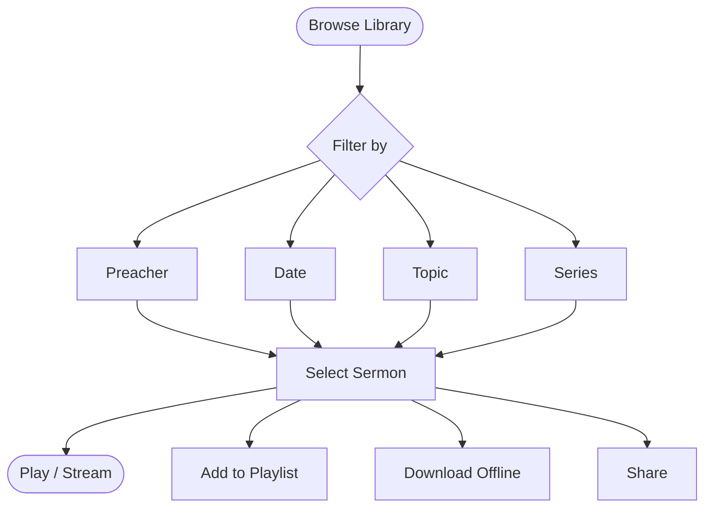

# Sermons

The sermon library is the heart of the CGC platform. With thousands of sermons available, you can browse, stream, download, and organize messages from preachers across the Christ Gospel Church community.

*Diagram: Sermon discovery journey*

## Browsing Sermons

There are several ways to find sermons in the library:

### By preacher

- Go to the **Sermons** section and select **Preachers**
- Browse the list of preachers, each with a photo and name
- Tap on a preacher to see all of their available sermons
- Sermons are listed with the most recent first by default

### By topic

- Select **Topics** or **Categories** to filter sermons by theme
- Topics include areas like faith, prayer, worship, family, salvation, and many more
- Tap a topic to see all sermons tagged with that theme

### By date

- Browse sermons chronologically using the **Date** filter
- View sermons from a specific month, year, or date range
- Useful for finding sermons from a particular service or event

### By sermon series

- Many sermons are part of a multi-part **series**
- Browse available series to follow a preacher's teaching on a topic from beginning to end
- Series are displayed with the number of parts and the preacher's name

### Using search

- Tap the **Search** icon and type a keyword, title, scripture reference, or phrase
- The search engine uses [AI-powered search](/features/ai-features) to understand what you are looking for, even if you do not use the exact title
- Results are ranked by relevance and include sermons, series, and related content
- You can filter search results by preacher, topic, date, and content type (audio or video)

### Available metadata

Each sermon includes helpful details:

- **Title** — The name of the sermon
- **Preacher** — Who delivered the message
- **Date** — When the sermon was preached
- **Topic / Category** — The themes and subjects covered
- **Scripture Reference** — Key Bible passages referenced in the sermon
- **Duration** — How long the sermon is
- **Description** — A brief summary of the sermon content
- **Series** — If the sermon is part of a series, the series name and part number

---

## Streaming Sermons

You can stream any sermon directly in the app or web browser without downloading it first.

### How to stream

1. Find the sermon you want to listen to or watch
2. Tap the sermon to open it
3. Tap the **Play** button to start streaming
4. Use the player controls to pause, rewind, fast-forward, or adjust the volume

### Streaming quality options

- **Audio**: Available in Standard and High quality. High quality provides clearer audio but uses more data.
- **Video**: Videos stream in adaptive quality by default, automatically adjusting to your internet speed for smooth playback.
- You can set your preferred streaming quality in **Settings > Playback > Streaming Quality**.

### Background playback

- When you start playing a sermon, audio continues playing even if you:
  - Switch to another app
  - Lock your phone screen
  - Navigate to a different section of the CGC app
- Control playback from your device's lock screen or notification shade
- Make sure **background audio** is enabled in your device settings for uninterrupted listening

::: tip
For the best streaming experience, use a Wi-Fi connection. Audio streaming uses approximately 1 MB per minute, and video uses approximately 5-10 MB per minute.
:::

---

## Downloading Sermons for Offline Listening

With an active subscription, you can download sermons to your device for offline access. This is perfect for times when you do not have an internet connection, such as traveling or commuting.

### How to download

1. Find the sermon you want to download
2. Tap the **Download** button (down arrow icon)
3. Choose whether to download **audio only** or **video** (if available)
4. The download will begin — a progress indicator will show the status
5. Once complete, the sermon appears in your **Downloads** section

### Download settings

Customize your download preferences in **Settings > Downloads**:

- **Wi-Fi only** — When enabled, downloads will only start when connected to Wi-Fi (recommended to save mobile data). This is on by default.
- **Audio quality** — Choose between Standard and High quality
- **Video quality** — Choose between Standard (SD) and High (HD). Higher quality means larger file sizes.

### Managing downloads

- View all your downloads in the **Downloads** section
- See the file size and date for each download
- Delete individual downloads by swiping left (iOS) or long-pressing (Android)
- Clear all downloads at once in **Settings > Storage > Clear All Downloads**

For more details, see the [Offline & Downloads Guide](/help/offline-downloads).

---

## Creating Playlists

Organize your favorite sermons into custom playlists for easy access.

### How to create a playlist

1. While viewing a sermon, tap the **three-dot menu** (or long-press the sermon)
2. Select **Add to Playlist**
3. Tap **Create New Playlist** and give it a name
4. The sermon will be added to your new playlist

### How to add sermons to an existing playlist

1. Tap the three-dot menu on any sermon
2. Select **Add to Playlist**
3. Choose the playlist from your list
4. The sermon is added at the end of the playlist

### Managing playlists

- **Reorder**: Open a playlist and drag items to change the order
- **Remove**: Swipe left on a sermon (iOS) or long-press and select Remove (Android)
- **Rename**: Tap the playlist name or edit icon to rename it
- **Delete**: Open the playlist, tap the three-dot menu, and select **Delete Playlist**

Your playlists sync across all devices signed in with the same account.

---

## Sharing Sermons

Share sermons with friends, family, and your community.

### How to share

1. Open the sermon you want to share
2. Tap the **Share** button (the share icon)
3. Choose how you want to share:
   - **Copy link** — Copies a shareable link to your clipboard
   - **Share via app** — Opens your device's share sheet so you can send the link through messaging apps, email, social media, and more
4. The recipient can tap the link to open the sermon in the CGC app (if installed) or on the web

::: info
Sharing sends a link to the sermon. The recipient may need an account or subscription to access certain content.
:::

---

## Sermon Series

Many sermons are organized into multi-part series that explore a topic or scripture passage in depth.

### How to find series

- Browse the **Series** section to see all available sermon series
- Each series shows the title, preacher, number of parts, and a description
- Tap a series to see all included sermons in order

### Following a series

- Play a series from the beginning and each sermon will be listed in order
- The app keeps track of your progress within a series
- Pick up where you left off at any time

---

## For Administrators

Administrators can manage sermons through the Admin Dashboard at [admin.christgospel.org](https://admin.christgospel.org). Admin capabilities include:

- **Upload** audio and video files
- **Set metadata** — titles, descriptions, preachers, topics, scripture references, and series
- **Schedule** sermons for future publication dates
- **Edit** existing sermons at any time
- **Organize** sermons into series and categories
- **Manage media files** — replace or update audio and video files
- **Feature sermons** — select the Weekly Sermon to highlight on the home screen

For a complete guide to managing sermons as an administrator, see the [Church Administrator Guide](/help/admin-guide).

---

## Questions?

If you have trouble finding or playing a sermon, check our [Troubleshooting](/help/troubleshooting) guide or contact us at **support@christgospel.org**.
